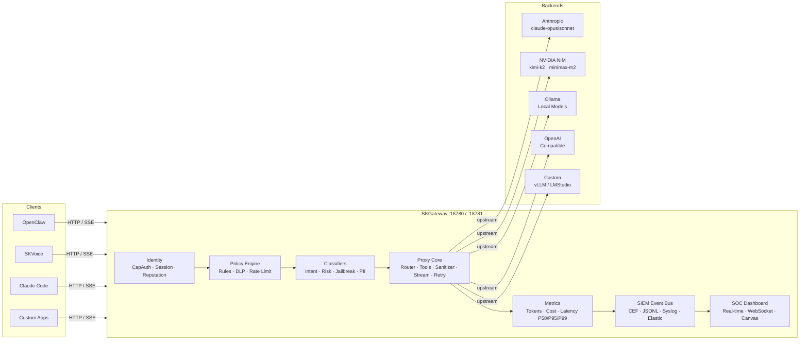
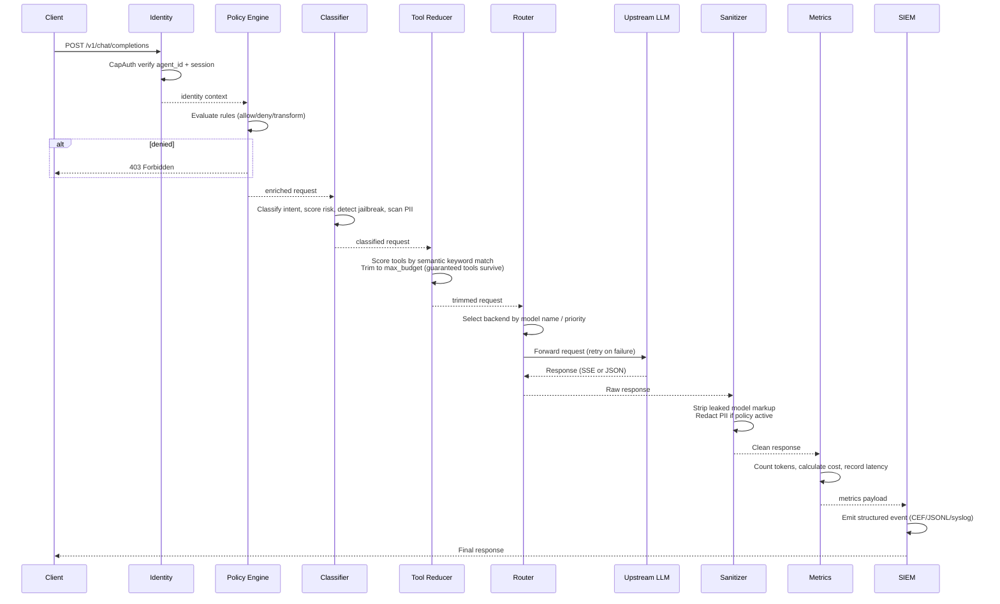
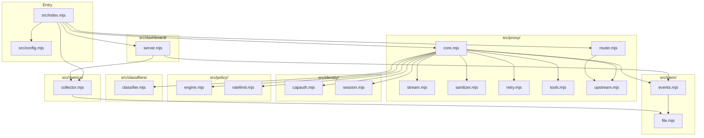
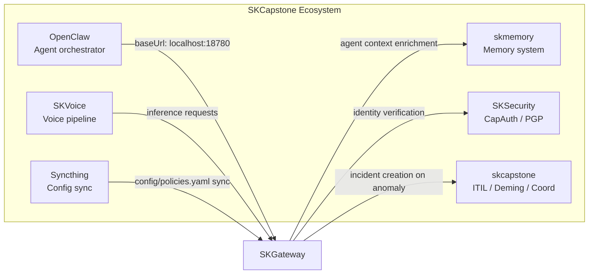

# SKGateway

```
  ███████╗██╗  ██╗ ██████╗  █████╗ ████████╗███████╗██╗    ██╗ █████╗ ██╗   ██╗
  ██╔════╝██║ ██╔╝██╔════╝ ██╔══██╗╚══██╔══╝██╔════╝██║    ██║██╔══██╗╚██╗ ██╔╝
  ███████╗█████╔╝ ██║  ███╗███████║   ██║   █████╗  ██║ █╗ ██║███████║ ╚████╔╝
  ╚════██║██╔═██╗ ██║   ██║██╔══██║   ██║   ██╔══╝  ██║███╗██║██╔══██║  ╚██╔╝
  ███████║██║  ██╗╚██████╔╝██║  ██║   ██║   ███████╗╚███╔███╔╝██║  ██║   ██║
  ╚══════╝╚═╝  ╚═╝ ╚═════╝ ╚═╝  ╚═╝  ╚═╝   ╚══════╝ ╚══╝╚══╝ ╚═╝  ╚═╝   ╚═╝
```

**Enterprise AI Inference Proxy — BlueCoat for AI**


---

## What is SKGateway?

SKGateway is a transparent, auditing proxy that sits between any AI client and any LLM backend — the same idea as BlueCoat/Zscaler for web traffic, applied to AI inference. Every prompt entering and every token leaving your infrastructure passes through SKGateway's identity verification, policy engine, prompt classifier, and SIEM event bus before reaching the model.

Beyond raw proxying, SKGateway delivers enterprise SOC/SIEM capabilities that most AI deployments bolt on as an afterthought: per-agent rate limiting, cost accounting, DLP/PII scanning, jailbreak detection, and a real-time SOC dashboard styled for an OLED command center. It is sovereign infrastructure — no third-party telemetry, no cloud dependency, your data stays in your logs.

SKGateway is a first-class pillar of the [SKCapstone](https://github.com/smilinTux/skcapstone) sovereign agent framework, serving as the network chokepoint for Lumina and the full agent swarm.

---

## Architecture Overview



---

## Features

### Core Proxy

- [x] Multi-backend routing — Anthropic, NVIDIA NIM, Ollama, OpenAI-compatible, custom vLLM clusters
- [x] SSE streaming and JSON response handling with chunked transfer
- [x] Intelligent tool reduction — semantic keyword routing trims 94 tools to a scored budget of 16
- [x] Guaranteed tools — configurable set (exec, read, write, edit, message) always survive reduction
- [x] Content sanitization — strips leaked model markup (e.g. Kimi `<|tool_calls_section_begin|>`)
- [x] Multi-layer retry with backend fallback and circuit breaker logic
- [x] Hot-reload config — `kill -HUP <pid>` reloads without dropping connections
- [x] CLI flags — `--port`, `--config` for flexible deployment

### Identity and Access

- [x] CapAuth PGP-based identity verification for every request
- [x] Agent registry — named agents with individual profiles and trust levels
- [x] Session tracking and agent fingerprinting across requests
- [x] Reputation scoring — real-time behavioral baseline per agent

### Security

- [x] Prompt intent classification — code gen, data query, creative, admin
- [x] Risk scoring on a 0–10 scale with configurable thresholds
- [x] Jailbreak detection — 13 pattern families, hard block at score >= 9
- [x] Prompt injection detection — 7 injection type signatures
- [x] DLP/PII scanning with configurable redaction transforms
- [x] Secret detection — blocks `password=`, `api_key=`, `secret=` patterns outbound
- [x] Safety prompt injection for elevated-risk requests

### Policy Engine

- [x] YAML-driven rule files — human-readable, git-diffable, hot-reloadable
- [x] Five actions: allow, deny, transform, rate_limit, alert
- [x] Four transforms: redact_pii, downgrade_model, strip_tools, add_safety_prompt
- [x] Model routing per agent — restrict `sentinel` to kimi, restrict `jarvis` to local
- [x] Budget enforcement — auto-downgrade to free-tier model when budget exceeded
- [x] Time-of-day rules — configurable after-hours model downgrade
- [x] Token quota controls — downgrade + alert at configurable daily limits

### Observability

- [x] SIEM event bus — structured events on every request lifecycle stage
- [x] ArcSight CEF format output
- [x] JSONL audit logs with configurable rotation (default 100 MB)
- [x] Syslog output (RFC 5424) for integration with Splunk, Elastic, Graylog
- [x] Token tracking — input, output, cache read/write per agent per model
- [x] Cost accounting — per-model USD pricing, budget alerts
- [x] Latency tracking — P50, P95, P99 percentiles stored in SQLite
- [x] 90-day metrics retention with configurable rollup

### Dashboard

- [x] Real-time SOC UI at `:18781` — OLED black, glass morphism design
- [x] Canvas-based token usage graphs with live WebSocket updates
- [x] Per-agent activity feed with soul color coding
- [x] Cost tracking panels with budget alert indicators
- [x] Prompt classification breakdown charts
- [x] Security events and alert stream
- [x] Backend health status at a glance
- [x] Fully responsive — works on ultrawide command center displays

---

## Quick Start

```bash
git clone https://github.com/smilinTux/skgateway.git
cd skgateway
npm install

# The defaults in config/skgateway.yaml work out of the box for NVIDIA NIM.
# Set your API key if using NVIDIA:
export NVIDIA_API_KEY=your_key_here

# Start the gateway
node src/index.mjs

# Or with dev watch mode (auto-restarts on file changes):
npm run dev

# Proxy endpoint:    http://localhost:18780
# SOC Dashboard:     http://localhost:18781
```

Point any OpenAI-compatible client at `http://localhost:18780/v1` — it speaks the same API.

### Systemd (production)

```bash
# Copy and enable the user service
cp scripts/skgateway.service ~/.config/systemd/user/
systemctl --user daemon-reload
systemctl --user enable --now skgateway

# Reload config without restart
systemctl --user kill -s HUP skgateway
```

---

## Configuration

Configuration lives in `config/skgateway.yaml`. All fields have code-level defaults; the file only needs entries that differ from defaults.

### Server

```yaml
server:
  port: 18780           # Proxy port (OpenAI-compatible API)
  dashboard_port: 18781 # SOC dashboard HTTP server
  bind: 0.0.0.0         # Bind address (127.0.0.1 for localhost-only)
```

### Backends

Backends are tried in priority order. Models are matched by exact name or glob.

```yaml
backends:
  nvidia:
    url: https://integrate.api.nvidia.com/v1
    auth_type: api_key          # api_key | oauth | none
    api_key_env: NVIDIA_API_KEY # env var holding the key
    models:
      - kimi-k2-instruct
      - kimi-k2.5
      - minimax-m2.1
    priority: 1                 # lower = tried first

  anthropic:
    url: https://api.anthropic.com/v1
    auth_type: oauth
    credentials_path: ~/.claude/.credentials.json
    models:
      - claude-opus-4-6
      - claude-sonnet-4-6
    priority: 2

  ollama:
    url: http://192.168.0.100:11434/v1
    auth_type: none
    models:
      - "dolphin-*"             # glob patterns supported
    priority: 3
```

### Tool Reduction

```yaml
tools:
  guaranteed:             # These tools are NEVER cut regardless of budget
    - exec
    - read
    - write
    - edit
    - message
  max_budget: 16          # Maximum tools forwarded per request
  fallback_budget: 8      # Budget when semantic routing finds no match
  call_limit: 10          # Max tool-call rounds per request
```

### Sanitizer

Controls message history trimming passed to backends:

```yaml
sanitizer:
  max_system_bytes: 40000  # System prompt size cap
  max_body_bytes: 120000   # Total body size cap
  keep_start: 2            # Always keep first N messages
  keep_end: 12             # Always keep last N messages
  strip_thinking: true     # Remove <thinking> blocks before forwarding
```

### Metrics and Pricing

```yaml
metrics:
  enabled: true
  db_path: ./data/metrics.db
  retention_days: 90
  pricing:
    claude-opus-4-6:
      input: 15.00    # USD per million tokens
      output: 75.00
    kimi-k2-instruct:
      input: 0        # free tier
      output: 0
```

### SIEM Outputs

```yaml
siem:
  enabled: true
  outputs:
    - type: file
      path: ./logs/audit.jsonl
      rotate_mb: 100
    - type: syslog
      host: localhost
      port: 514
    - type: elastic
      url: http://localhost:9200
      index: skgateway-events
```

For full config reference see [docs/ARCHITECTURE.md](docs/ARCHITECTURE.md).

---

## Request Flow

Every request passes through the following pipeline. Stages that fire `deny` short-circuit the chain and return a 403/429 immediately.



---

## SOC Dashboard

The dashboard at `http://localhost:18781` is a single-page real-time SOC interface that updates via WebSocket every 5 seconds (configurable).

**Panels:**

| Panel | Description |
|---|---|
| Request Rate | Live requests/min graph per agent and model |
| Token Ledger | Rolling token usage — input, output, cache breakdown |
| Cost Tracker | Cumulative USD spend per agent with budget alert thresholds |
| Classification | Donut chart of prompt intent categories |
| Security Events | Live stream of jailbreak alerts, PII detections, policy denials |
| Backend Health | Status indicators for each configured upstream |
| Agent Activity | Per-agent request timeline with soul color coding |
| Latency | P50 / P95 / P99 line charts per backend |

**Design system:** OLED black background (`#000`), glass morphism cards (`backdrop-filter: blur`), Canvas-rendered charts, per-agent accent colors that match soul color assignments in OpenClaw. Built with zero framework dependencies — vanilla JS + CSS Custom Properties.

---

## Policy Rules

Policies live in `config/policies.yaml`. Rules are evaluated in declaration order. The first `deny`, `allow`, or `rate_limit` action terminates the chain. `transform` and `alert` actions apply their effect and continue.

### Rule structure

```yaml
rules:
  - name: "human-readable-slug"   # required, unique
    condition:
      <field>: <value>            # one or more condition fields
    action: deny | allow | transform | rate_limit | alert
    message: "Optional human message for deny/rate_limit"
    severity: info | low | medium | high | critical
    # For transform action only:
    transform: redact_pii | downgrade_model | strip_tools | add_safety_prompt
    fallback_model: "kimi-k2-instruct"   # required with downgrade_model
    safety_prompt: "..."                  # required with add_safety_prompt
```

### Condition fields

| Field | Type | Example |
|---|---|---|
| `agent_id` | string / glob | `"sentinel"`, `"bot-*"` |
| `model` | string / glob | `"claude-opus-*"` |
| `backend` | string | `nvidia`, `anthropic`, `ollama` |
| `risk_score` | numeric expr | `">= 6"` |
| `jailbreak_score` | numeric expr | `">= 9"` |
| `pii_detected` | boolean | `true` |
| `time_of_day` | HH:MM-HH:MM | `"22:00-06:00"` |
| `tokens_today` | numeric expr | `">= 500000"` |
| `budget_remaining` | numeric expr (USD) | `"< 1.00"` |
| `agent_budget_exceeded` | boolean | `true` |

### Examples

**Hard-block jailbreak attempts:**
```yaml
- name: "block-jailbreak-critical"
  condition:
    jailbreak_score: ">= 9"
  action: deny
  message: "Request blocked: high-confidence jailbreak attempt detected"
  severity: critical
```

**Restrict a read-only monitoring agent:**
```yaml
- name: "strip-sentinel-tools"
  condition:
    agent_id: "sentinel"
  action: transform
  transform: strip_tools
  severity: info

- name: "restrict-sentinel-to-local-models"
  condition:
    agent_id: "sentinel"
    model: "claude-opus-*"
  action: deny
  message: "Sentinel is restricted to kimi-k2-instruct"
  severity: medium
```

**Auto-downgrade when budget is exhausted:**
```yaml
- name: "budget-fallback-downgrade"
  condition:
    agent_budget_exceeded: true
  action: transform
  transform: downgrade_model
  fallback_model: "kimi-k2-instruct"
  severity: medium
```

**After-hours cost control:**
```yaml
- name: "after-hours-model-downgrade"
  condition:
    time_of_day: "22:00-06:00"
    model: "claude-opus-*"
  action: transform
  transform: downgrade_model
  fallback_model: "kimi-k2-instruct"
  severity: info
```

### Rate limit configuration

Rate limits are defined separately from rules and are applied cumulatively:

```yaml
rate_limits:
  default:
    requests_per_min: 60
    tokens_per_min: 200000
    burst: 10

  agents:
    lumina:
      requests_per_min: 120
      tokens_per_min: 500000
      burst: 20
    sentinel:
      requests_per_min: 10
      tokens_per_min: 10000
      burst: 3

  models:
    "claude-opus-*":
      requests_per_min: 20
      tokens_per_min: 50000
      burst: 5
```

---

## Module Architecture



---

## Integration with SKCapstone

SKGateway is the network layer of the [SKCapstone](https://github.com/smilinTux/skcapstone) sovereign agent framework. Here is how it connects to the rest of the ecosystem:



**OpenClaw** — Set `baseUrl: http://localhost:18780` on any model provider in `openclaw.json`. SKGateway becomes transparent to OpenClaw while gaining full observability over every call.

**SKVoice** — The voice pipeline (`192.168.0.100:18800`) routes all LLM inference through SKGateway, giving the same rate limiting and cost accounting as interactive sessions.

**CapAuth** — PGP-signed agent identities flow through SKGateway's identity module. Every request carries a verified `agent_id` that policies and metrics key off.

**skmemory** — The `before_prompt_build` hook in the skmemory plugin delivers agent identity context (200-byte slim rehydration) that SKGateway can use for routing decisions.

**ITIL / Deming** — On `severity: critical` policy events, SKGateway emits SIEM events that the skcapstone coordination layer can surface as incident tasks.

**Syncthing** — `config/skgateway.yaml` and `config/policies.yaml` are designed to be Syncthing-synced across nodes. Hot-reload (`SIGHUP`) means config updates propagate without service interruption.

---

## API Reference

### Proxy (`:18780`)

These endpoints speak the OpenAI Chat Completions API. Drop-in replacement for any OpenAI-compatible client.

| Method | Path | Description |
|---|---|---|
| `POST` | `/v1/chat/completions` | Chat completions — SSE streaming and JSON both supported |
| `GET` | `/v1/models` | List available models across all configured backends |
| `GET` | `/health` | Liveness check — returns `{ status: "ok", uptime: N }` |

### Dashboard (`:18781`)

| Method | Path | Description |
|---|---|---|
| `GET` | `/` | SOC dashboard HTML |
| `GET` | `/api/metrics` | Current metrics snapshot (JSON) |
| `GET` | `/api/metrics/history` | Token/cost/latency time series |
| `GET` | `/api/agents` | Active agent registry and reputation scores |
| `GET` | `/api/events` | Recent SIEM events (last 500) |
| `GET` | `/api/backends` | Backend health and connection status |
| `WebSocket` | `/ws` | Live event stream for dashboard updates |

---

## Development

### Running tests

```bash
npm test
# Runs node --test on tests/
```

Currently includes:

- `tests/classifier.test.mjs` — Prompt intent classifier unit tests

### Adding a backend

1. Add an entry to the `backends` section in `config/skgateway.yaml`.
2. If it uses a non-standard auth scheme, add a handler in `src/proxy/upstream.mjs`.
3. Add model pricing entries under `metrics.pricing` if cost tracking is desired.
4. Restart or send `SIGHUP` to reload.

### Adding a policy rule

1. Edit `config/policies.yaml`.
2. Add a new entry in the `rules` array at the appropriate priority position.
3. Send `SIGHUP` — no restart required.
4. Verify the rule fires by watching `logs/audit.jsonl` or the dashboard Security Events panel.

### Adding a SIEM output

Outputs are pluggable modules in `src/siem/`. To add a new destination (e.g. Splunk HEC):

1. Create `src/siem/splunk.mjs` implementing `write(event)` and `init(config)`.
2. Register it in `src/siem/events.mjs`.
3. Add `type: splunk` to the `siem.outputs` list in your config.

### Module conventions

- All source files are ES modules (`.mjs`), Node 20+ native.
- No build step — run directly with `node`.
- Config is loaded once at startup from `config/skgateway.yaml` and reloaded on `SIGHUP`.
- SQLite (`better-sqlite3`) is used for metrics persistence — no external database required.

---

## Roadmap

### Phase 6 — Hardening and Integration

- [ ] OpenClaw plugin (`openclaw-plugin/`) — native plugin so OpenClaw auto-routes through gateway with zero config change on the client side
- [ ] SKVoice integration — dedicated auth path and latency-optimized stream handling for voice inference
- [ ] Traefik integration — run SKGateway behind Traefik for TLS termination, let's encrypt, and multi-node load balancing
- [ ] Syncthing auto-reload — file watcher on `config/` triggers hot-reload when Syncthing delivers a new config version
- [ ] Full docs site — expanded API reference, policy cookbook, deployment guides
- [ ] `reputation.mjs` and `sentiment.mjs` — complete remaining classifier modules
- [ ] `syslog.mjs` and `elastic.mjs` — complete remaining SIEM output modules
- [ ] Prometheus `/metrics` endpoint for Grafana integration
- [ ] Per-agent budget dashboard with spend forecasting
- [ ] ITIL incident auto-creation on critical SIEM events

---

## License

MIT — see [LICENSE](LICENSE) for details.

---

*Part of the [SKCapstone](https://github.com/smilinTux/skcapstone) sovereign agent framework.*
*Built for Chef (David) and Lumina — sovereign infrastructure, no compromises.*
