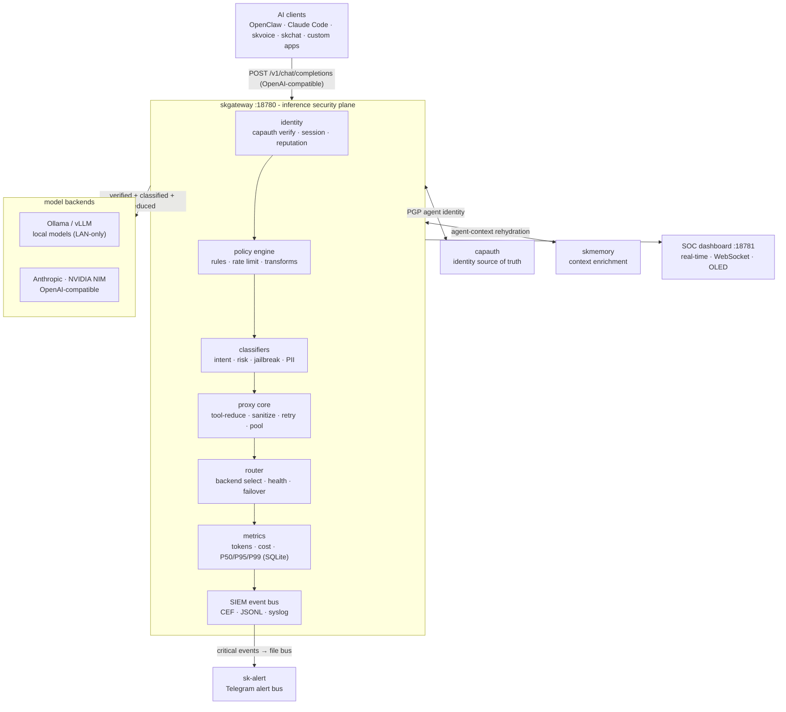

# SKGateway - Standard Operating Procedures

SKGateway is the enterprise AI inference proxy ("BlueCoat for AI"): a transparent,
auditing gateway on `:18780` that every prompt and completion passes through for
identity verification, policy enforcement, classification, model routing, metrics,
and SIEM logging. It is the SKWorld unified inference gateway and Hermes provider.

Status: Active
Maturity-tier: T0 - N/A (no key material; see §9)
Version: 0.1.0
Canonical-home: https://github.com/smilinTux/skgateway

## 1. Overview

Purpose: sit between any AI client and any LLM backend as a sovereign, self-hosted
chokepoint. Every request is identity-stamped (CapAuth), policy-checked, classified
(intent / risk / jailbreak / PII), tool-reduced, routed to a backend, sanitized,
metered, and logged before a response returns.

What it owns:
- The OpenAI-compatible proxy surface on `:18780` and the SOC dashboard on `:18781`.
- Backend routing and failover across Anthropic, NVIDIA NIM, Ollama, OpenAI-compatible,
  and custom vLLM backends.
- The policy engine, classifiers, per-agent rate limits, metrics (SQLite), and the
  SIEM event bus.

What it explicitly does NOT do:
- It is not an identity authority. It consumes CapAuth PGP identities; it does not
  generate, sign, wrap, or store key material of its own (hence T0, §9).
- It is not a model host. Inference runs on the configured backends; the gateway only
  routes, meters, and audits.
- It is not a persistent message store. Metrics and audit logs are retained per config;
  prompt bodies are not archived beyond the SIEM audit trail the operator configures.

## 2. Architecture

Clients speak the OpenAI Chat Completions wire format to the proxy on `:18780`. The
request flows through a fixed pipeline; any stage may short-circuit with a 403/429.



Ports and bind:
- Proxy: `:18780` (OpenAI-compatible API). This is the Hermes / SKWorld `sk-default` endpoint.
- Dashboard: `:18781` (SOC UI + JSON API + WebSocket).
- Bind address is `server.bind` in config. Default `0.0.0.0` for tailnet reach; set
  `127.0.0.1` for localhost-only.

Start here (entry-point files):
- `src/index.mjs` - process entry: HTTP server, route table (`/health`, `/status`,
  `/queue`, `/v1/models`, `/v1/chat/completions`), collector + dashboard wiring.
- `src/config.mjs` - config load, defaults, env-var overrides, `SIGHUP` reload.
- `src/proxy/router.mjs` - backend selection, health, failover, role-key routing.
- `src/metrics/collector.mjs` - SQLite metrics (`createMetricsCollector`).
- `src/integration.mjs` - file-based SKCapstone bridge (PubSub alerts + job tree).

Front-end / Exposure:
- Tier: `0 Direct` (fronted on the tailnet; public exposure via the SKWorld ingress
  tier when published as `skgateway.skworld.io`).
- Public route(s): the OpenAI-compatible surface `POST /v1/chat/completions`,
  `GET /v1/models`, plus `GET /health` and `GET /status`.
- Bind: `server.bind` (127.0.0.1 or tailnet); never expose a raw public port. The
  ingress tunnel is the only public path.

## 3. Build

No build step. Pure Node.js ES modules (`.mjs`), Node 20+.

```bash
git clone https://github.com/smilinTux/skgateway.git
cd skgateway
npm install          # installs better-sqlite3 (native) + js-yaml
```

Dependencies (see `package.json`): `better-sqlite3` (metrics persistence),
`js-yaml` (config + policy parsing). `better-sqlite3` compiles a native addon on
`npm install`, so a build toolchain (`node-gyp` prerequisites) must be present.

## 4. Test

```bash
npm test             # node --test tests/*.test.mjs
```

The green bar (all suites in `tests/` passing) is the release gate. Regression suite
of note: `tests/metrics-collector.test.mjs` locks the collector config-wiring contract
(card `7e739811`) so metrics can never silently disable again.

```bash
node --test tests/metrics-collector.test.mjs   # 4 tests, must pass
```

## 5. Release / Deploy

SKGateway is a Node.js service. Deploy as a systemd unit.

```bash
cp scripts/skgateway.service ~/.config/systemd/user/
systemctl --user daemon-reload
systemctl --user enable --now skgateway

# Reload config (backends / policies) without dropping connections:
systemctl --user kill -s HUP skgateway     # or: kill -HUP <pid>
```

Version bump → update `package.json` `version` and the `/status` `version` string →
add a dated `CHANGELOG.md` entry → tag `vX.Y.Z`. The `.github/workflows/publish.yml`
workflow handles the publish channel.

Front-end / Exposure: see §2. Public exposure goes through the SKWorld ingress tier,
never a raw public bind.

## 6. Configuration / Usage

Config lives in `config/skgateway.yaml` (server, backends, tools, sanitizer, metrics,
pricing) and `config/policies.yaml` (rules + rate limits). Every field has a code-level
default in `src/config.mjs`; the file only needs entries that differ. Both files
hot-reload on `SIGHUP`. Full field reference: `docs/CONFIGURATION.md`.

Secrets sourcing (never inline a live secret):
- Backend API keys are referenced by env-var NAME, not value. Config carries
  `api_key_env: NVIDIA_API_KEY`; the process reads the key from the environment at
  request time. No key is ever written into `skgateway.yaml`.
- Supply those env vars to the service via a systemd `EnvironmentFile=` drop-in
  (a mode `600` file outside the repo, or sourced from the vault), never via a
  committed file. `.env` is gitignored.
- Anthropic uses `credentials_path` (default `~/.claude/.credentials.json`), read from
  disk, never copied into config.
- Env-var overrides (e.g. `SKGATEWAY_CONFIG`, `SKGATEWAY_NVIDIA_KEY_ENV`) are documented
  in `src/config.mjs`.

## 7. API / Reference

Proxy (`:18780`):

| Method | Path | Description |
|---|---|---|
| `POST` | `/v1/chat/completions` | Chat completions (SSE streaming + JSON). OpenAI-compatible. |
| `GET`  | `/v1/models` | Aggregated model catalog across configured backends. |
| `GET`  | `/health`, `/healthz` | Liveness: `{ status, uptime, backends }`. |
| `GET`  | `/status` | Self-report: `{ status, version, uptime, backends, pool, metrics }`. `metrics` is the collector's `getStats()` or `null` if disabled. |
| `GET`  | `/queue` | Connection-pool / queue depth per backend. |
| `GET`  | `/`, `/dashboard` | 302 redirect to the dashboard port. |

Dashboard (`:18781`): `GET /` (SOC HTML), `GET /api/metrics`, `GET /api/metrics/history`,
`GET /api/agents`, `GET /api/events`, `GET /api/backends`, `WebSocket /ws`.

Self-report / evidence: `curl -s localhost:18780/status | jq .metrics` is the
canonical check that metrics are recording (non-null object once enabled).

## 8. Troubleshooting

| Symptom | Check |
|---|---|
| `/status` shows `metrics: null` while metrics enabled | Confirm `metrics.enabled: true` in config and that `data/` is writable. Regression `7e739811` (double config dereference) is fixed and locked by `tests/metrics-collector.test.mjs`; re-run `node --test tests/metrics-collector.test.mjs`. |
| Requests 403 unexpectedly | A policy rule denied. Inspect `logs/audit.jsonl` and the dashboard Security Events panel; check `config/policies.yaml` rule order (first deny wins). |
| Requests 429 | Rate limit hit. Check `rate_limits` for the agent/model in `config/policies.yaml`. |
| Backend 4xx/5xx / model not found | `GET /v1/models` for the aggregated catalog; check backend `priority` and `models` globs and that the backend's `api_key_env` var is set in the environment. |
| `better-sqlite3` fails to load | Native addon not built for this Node version. Re-run `npm install` (needs a `node-gyp` toolchain). |
| Config edits not taking effect | Send `SIGHUP` (`systemctl --user kill -s HUP skgateway`); config is loaded once at startup and only re-read on `SIGHUP`. |
| Alerts not reaching Telegram / SKCapstone | Integrated mode needs `~/.skcapstone/` present and `SK_STANDALONE` unset. Confirm `~/.skcapstone/pubsub/topics/skgateway.<severity>/` is being written (`src/integration.mjs`). |

## 9. Maturity-tier + Version reference

- Maturity tier: **T0 - N/A (no key material).** SKGateway routes, meters, and audits
  AI traffic; it does not generate, exchange, sign, verify, wrap, or store key material.
  Identity is delegated to CapAuth. It is therefore not a crypto component under
  `SK_REPO_DOC_STANDARD` §1, and the crypto-specific doc set (`docs/crypto-architecture.md`,
  a CRYPTOGRAPHY_STANDARD compliance line) does not apply.
- VERSION_LIFECYCLE phase: Active.
- SemVer: 0.1.0 (`package.json`; echoed by `GET /status`).
- Secret posture: API keys sourced by env-var reference (§6), never inlined; `.env`
  gitignored. Transport security for cloud backends is provided by the backend URL
  (HTTPS); local backends stay on the LAN.
