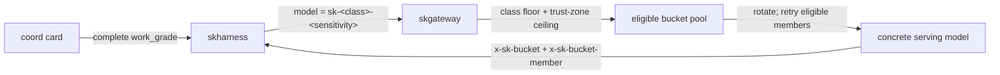
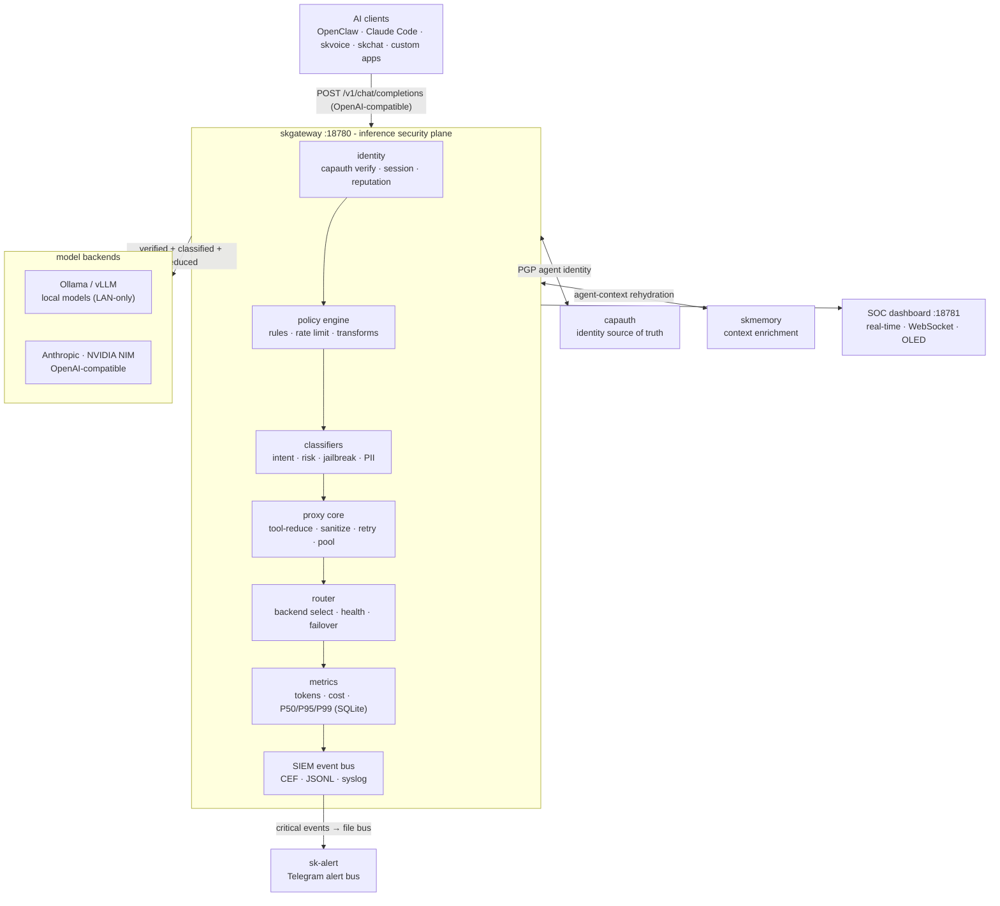

# SKGateway - Standard Operating Procedures

SKGateway is the enterprise AI inference proxy ("BlueCoat for AI"): a transparent,
auditing gateway on `:18780` that every prompt and completion passes through for
identity verification, policy enforcement, classification, model routing, metrics,
and SIEM logging. It is the SKWorld unified inference gateway and Hermes provider.

Status: Active
Maturity-tier: T0 - N/A (no key material; see §9)
Version: derived from the git tag at publish time, see §9. Do not trust the `0.1.0`
that `package.json` and `GET /status` still report.
Repo visibility: **private**. Licence: **MIT** (`LICENSE`, `package.json` `"license": "MIT"`).
Canonical-home: https://github.com/smilinTux/skgateway

## 1. Overview

Purpose: sit between any AI client and any LLM backend as a sovereign, self-hosted
chokepoint. Every request is identity-stamped (CapAuth), policy-checked, classified
(intent / risk / jailbreak / PII), tool-reduced, routed to a backend, sanitized,
metered, and logged before a response returns.

What it owns:
- The OpenAI-compatible proxy surface on `:18780` and the SOC dashboard on `:18781`.
- Backend routing and failover across Anthropic, NVIDIA NIM, Ollama, OpenAI-compatible,
  and custom vLLM backends.
- The policy engine, classifiers, per-agent rate limits, metrics (SQLite), and the
  SIEM event bus.

What it explicitly does NOT do:
- It is not an identity authority. It consumes CapAuth PGP identities; it does not
  generate, sign, wrap, or store key material of its own (hence T0, §9).
- It is not a model host. Inference runs on the configured backends; the gateway only
  routes, meters, and audits.
- It is not a persistent message store. Metrics and audit logs are retained per config;
  prompt bodies are not archived beyond the SIEM audit trail the operator configures.

## 2. Architecture

Clients speak **either** the OpenAI Chat Completions wire format **or** the Anthropic
Messages wire format to the proxy on `:18780`. The request flows through a fixed
pipeline; any stage may short-circuit with a 403/429.

**Two front-end wire formats, one pipeline.** `POST /v1/messages` accepts the Anthropic
Messages format, translates it to the OpenAI shape, routes it down the *same* path as
`/v1/chat/completions`, and translates the buffered result back (re-serialising via SSE
if the client asked for `stream: true`). That is what lets a `claude` CLI with
`ANTHROPIC_BASE_URL=http://<gw>:18780` reach any gateway model, local ornith included.
The match is **by pathname**, `req.url.split("?")[0] === "/v1/messages"`
(`src/index.mjs:1347`), specifically because Claude Code posts to `/v1/messages?beta=true`;
an exact `req.url === "/v1/messages"` comparison would miss it and drop an untranslated
Anthropic body into the raw OpenAI proxy. Do not "simplify" that comparison.

The default logical role is `sk-default` (`src/classifiers/empirical.mjs:46`,
`src/classifiers/difficulty.mjs:104`); callers should ask for the role, not a concrete
model name, and let the router resolve it.

### T-shirt sizing: grade to bucket to concrete model

The graded workflow addresses a capability/trust **pool**, not a named model. Upstream
`skharness` computes a complete `work_grade`; SKGateway consumes only its already-derived
`model_class` and `sensitivity`. It never re-grades the card.



There are exactly 12 addresses: the cross-product of `S`, `M`, `L`, `XL` and
`public`, `internal`, `secret`. `routing.buckets_enabled: true` arms routing and makes
all 12 visible in `/v1/models`; `/admin/buckets` explains current membership and
rejections. A class is a hard capability floor; sensitivity resolves to a hard maximum
trust zone. A larger capable model may serve, but a smaller model or a model outside the
zone may not.

The pool is derived from the same serving-config/discovery union, provider posture,
lifecycle state, and claimer-aware routing rule used by requests. Rotation selects a
starting member, then `402`, `429`, `5xx`, and bucket-scoped `404`/`410` advance through
the remaining eligible members. An empty pool fails closed with
`503 bucket_no_eligible_member`; a near-miss such as `sk-xl-secrets` fails with
`400 invalid_bucket_id` and never falls through to `sk-auto`.



Ports and bind:
- Proxy: `:18780` (OpenAI-compatible **and** Anthropic-compatible API). This is the
  Hermes / SKWorld `sk-default` endpoint.
- Dashboard: `:18781` (SOC UI + JSON API + WebSocket).
- Bind address is `server.bind` in config, defaulting to `0.0.0.0`
  (`src/config.mjs:81`), overridable per host with `SKGATEWAY_BIND`
  (`src/config.mjs:399`). See the exposure subsection below: the `0.0.0.0` default is a
  **live, deliberate deviation** from the ingress standard, not compliance with it.

Start here (entry-point files):
- `src/index.mjs` - process entry: HTTP server, route table (`/health`, `/healthz`,
  `/status`, `/queue`, `/v1/models`, `/v1/chat/completions`, `/v1/messages`,
  `/.well-known/skworld-module.json`, `/admin/models*`), collector + dashboard wiring.
- `src/config.mjs` - config load, defaults, env-var overrides, `SIGHUP` reload.
- `src/proxy/router.mjs` - backend selection, health, failover, role-key routing.
- `src/metrics/collector.mjs` - SQLite metrics (`createMetricsCollector`).
- `src/integration.mjs` - file-based SKCapstone bridge (PubSub alerts + job tree).

### Front-end / Exposure

- **Tier:** `0 Direct`. No reverse proxy in front of it; clients hit the port directly.
- **Public `:443` routes: none.** skgateway is not published through the SKWorld ingress
  tier and there is no `skgateway.skworld.io`.
- **Bind: `0.0.0.0:18780` and `0.0.0.0:18781`, on BOTH nodes.** Verified live on `.158`
  and on `.41` (`ss -ltnp | grep ':1878'` returns `0.0.0.0:18780` / `0.0.0.0:18781` on
  each). This is the `src/config.mjs:81` default taking effect; neither host overrides
  `server.bind` or sets `SKGATEWAY_BIND`.

**⚠️ This is a KNOWN DEVIATION from
[`UNIFIED_INGRESS_STANDARD.md`](https://github.com/smilinTux/sk-standards/blob/main/standards/UNIFIED_INGRESS_STANDARD.md),
stated here rather than papered over.** The standard says bind `127.0.0.1` or the tailnet
address, never a public port. `0.0.0.0` is **all interfaces**, which is strictly broader
than "the tailnet": it includes the LAN. The deviation is deliberate (the default exists
so the gateway is reachable across the tailnet without per-host config), but "deliberate"
is not the same as "compliant", and an earlier revision of this SOP restated the rule as
though it were met. It is not.

**Blast radius, scoped honestly.** The exposure is **LAN + tailnet, not the internet**:

- Neither node has a public interface. There is no port-forward to `:18780`.
- The only inbound path from the internet is Tailscale Funnel, and Funnel publishes
  `:443`, `:8443` and `:10000` only, proxying to `localhost:8765`, `127.0.0.1:9385`,
  `100.108.59.57:7880` and `localhost:9384`. **`:18780` and `:18781` are not among
  them** (`tailscale funnel status`), so no Funnel path reaches the gateway.
- What that leaves: any host on the physical LAN, and any device on the tailnet, can
  reach the proxy and the SOC dashboard directly. Treat both as sensitive. The dashboard
  in particular exposes agent activity and metrics with no auth of its own.

**To close the deviation** on a host that does not need LAN reach, set `server.bind` to
the tailnet IP (or `127.0.0.1`), or pass `SKGATEWAY_BIND`, and restart. This SOP will
need updating in the same change: the evidence block pins the documented `0.0.0.0`
default, so changing the default fails the docs gate by design.

## 3. Build

No build step. Pure Node.js ES modules (`.mjs`), Node 20+.

```bash
git clone https://github.com/smilinTux/skgateway.git
cd skgateway
npm install          # installs better-sqlite3 (native) + js-yaml
```

Dependencies (see `package.json`): `better-sqlite3` (metrics persistence),
`js-yaml` (config + policy parsing). `better-sqlite3` compiles a native addon on
`npm install`, so a build toolchain (`node-gyp` prerequisites) must be present.

## 4. Test

```bash
npm test             # node --test --import ./tests/_setup.mjs tests/*.test.mjs
```

Locally the green bar (all suites in `tests/` passing) is the release gate. Regression
suite of note: `tests/metrics-collector.test.mjs` locks the collector config-wiring
contract (card `7e739811`) so metrics can never silently disable again.

```bash
node --test tests/metrics-collector.test.mjs   # must pass
```

### The CI gate

`.github/workflows/ci.yml` runs `npm ci` then `npm test` on every **push** and
**pull request** to `main`/`master`, on a Node matrix of 20 and 22, with no `|| true`,
no `2>/dev/null` and no `continue-on-error`. A red suite fails the run.
`.github/workflows/publish.yml` repeats the same `test` job on a `v*` tag and gates
`publish-npm` on a plain `needs: test`, so a red suite blocks the npm publish.

Note both install with plain `npm ci`, **not** `npm ci --ignore-scripts`.
`better-sqlite3` resolves its native binding through an install script; skipping it
makes 19 metrics, energy and SIEM tests fail with `Could not locate the bindings file`
instead of on their own merits.

> **This was not always true, and the history matters.** Until card `62a5256d` there
> was no `ci.yml` at all. The only test invocation in CI lived in `publish.yml` and was
> neutralised four times over: the workflow was `on: push: tags: ["v*"]` so it never ran
> on a push or a PR; the step was `npm test 2>/dev/null || true`; the job also carried
> `continue-on-error: true`; and `publish-npm` had `needs: test` **plus** `if: always()`,
> so a total test failure still published to npm. A green checkmark certified only that
> a tag had been pushed. If any of those four patterns reappears in a diff, it is a
> regression, and the `docs-evidence` block below will go red.

`.github/workflows/` now holds four workflows: `ci.yml`, `publish.yml`,
`docs-check.yml` (the shared sk-standards gate at `tiers: "1,2,3"`, so the evidence
block at the end of this file is executed on every push) and `secret-scan.yml`
(pinned gitleaks binary, `--exit-code 1`).

#### Tests must not read live per-node state

`tests/_setup.mjs` is preloaded via `node --test --import` and pins two environment
variables **before any module is imported**, because both are bound at module load:

| Variable | Pinned to | Why |
|---|---|---|
| `SKGATEWAY_MODEL_CATALOG_STORE_PATH` | a fresh temp dir | otherwise the suite mutates the real per-node lifecycle store |
| `SKMODELS_REGISTRY` | a nonexistent path | otherwise `src/proxy/registry.mjs` defaults to the real `~/.skcapstone/models/registry.yaml`, and a populated registry registry-routes a test's fake model to a **live LAN backend** |

The second one was added under card `62a5256d`. `tests/siem-live-hook.test.mjs`
asserted `backend === "fake"` and got `reg:ornith` after an 8.7 second round trip to
`http://192.168.0.100:8082/v1`, because the developer box had a real registry and a bare
CI runner does not. That split (green on CI, red on the box that ships it) is the worst
possible failure mode for a gate, so the default is now "no registry configured" for
every test process. A suite that needs a registry still assigns `SKMODELS_REGISTRY`
itself at module scope before importing `registry.mjs`, and that assignment still wins.

**Verified 2026-08-20:** the focused bucket/catalog/claim-aware lifecycle suite passes
69/69, and the complete suite passes 1307/1307 on Node 22.23.2. Re-run the focused gate:

```bash
node --test --import ./tests/_setup.mjs \
  tests/bucket-routing-integration.test.mjs \
  tests/admin-buckets.test.mjs \
  tests/advertise-lifecycle.test.mjs \
  tests/model-claimer-lifecycle.test.mjs \
  tests/attribution-headers.test.mjs
```

## 5. Release / Deploy

SKGateway is a Node.js service. Deploy as a systemd unit.

```bash
cp scripts/skgateway.service ~/.config/systemd/user/
systemctl --user daemon-reload
systemctl --user enable --now skgateway

# Reload config (backends / policies) without dropping connections:
systemctl --user kill -s HUP skgateway     # or: kill -HUP <pid>
```

### ⚠️ What actually runs on the live nodes

Two things about the live deployment are invisible from this repo, and both bite.

**1. The effective `ExecStart` has no `--config`.** The base unit hardcodes it; a
drop-in strips it back off:

| | Command |
|---|---|
| Base unit `~/.config/systemd/user/skgateway.service` | `/usr/bin/node ~/clawd/skcapstone-repos/skgateway/src/index.mjs --port 18780 --config ~/clawd/skcapstone-repos/skgateway/config/skgateway.yaml` |
| Drop-in `skgateway.service.d/config-path.conf` | clears `ExecStart=` (the empty assignment resets the list-typed setting) and re-declares it **without** `--config` |
| **Effective, both nodes** | `/usr/bin/node /home/cbrd21/clawd/skcapstone-repos/skgateway/src/index.mjs --port 18780` |

That is not cosmetic. Dropping `--config` moves the service from precedence step 1 to
step 3 in §6, so it loads the **Syncthing-synced** `~/.skcapstone/gateway/skgateway.yaml`
instead of the in-repo file. Editing `config/skgateway.yaml` in the checkout and
wondering why nothing changed is the predictable symptom. Always read the effective
command, never the unit file:

```bash
systemctl --user show skgateway -p ExecStart   # the one that matters
systemctl --user cat  skgateway                # unit + every drop-in, in order
```

**2. `ExecStart` points into the shared working checkout,
`~/clawd/skcapstone-repos/skgateway`, on both nodes.** There is no build step and no
deployed artifact: the service executes the source files in that directory. So **an
uncommitted edit in that checkout is live behaviour**, immediately on the next restart,
with nothing in git recording it. Other sessions share that checkout. Never edit it to
"test something"; work in a worktree under `~/skworld-worktrees/`, commit, then pull.

### Versioning

Do **not** hand-set a version here. `publish-npm` overwrites `package.json` from the tag
(`npm version "${GITHUB_REF#refs/tags/v}" --no-git-tag-version`) at publish time, so the
tag is authoritative. Release flow: dated `CHANGELOG.md` entry, run `npm test` locally
(§4: CI will not do it for you), then tag `vX.Y.Z` and push the tag.

⚠️ The committed `package.json` version and the `version` string hardcoded at
`src/index.mjs:962` are **both stale** and are not updated by the publish flow. See §9.

Front-end / Exposure: see §2, including the `0.0.0.0` deviation.

### Fleet rollout from GitHub

The live checkout must be a fast-forward of GitHub, never a copied working tree:

```bash
git -C ~/clawd/skcapstone-repos/skgateway fetch --tags origin
git -C ~/clawd/skcapstone-repos/skgateway status --short
git -C ~/clawd/skcapstone-repos/skgateway pull --ff-only origin main
systemctl --user restart skgateway
systemctl --user is-active skgateway
curl -fsS http://127.0.0.1:18780/healthz
```

Stop if `status --short` is non-empty; preserve and reconcile local work before pulling.
After restart, compare `git rev-parse HEAD` with `git rev-parse origin/main` and verify
both `/v1/models` and `/admin/buckets`. A process listening on `:18780` whose PID is not
the unit's `MainPID` is an unmanaged duplicate and must not be treated as the deploy.

#### Bootstrap a headless node's GitHub access

Do not copy a workstation's general-purpose SSH identity or put a token in the remote
URL. Prefer, in order, a repository-scoped GitHub App installation token, a fine-grained
PAT with read-only Contents access to `smilinTux/skgateway`, or an organization-approved
machine identity. Store the credential in a node-local file with mode `0600` and bind
the helper only in this repository:

```bash
install -d -m 700 ~/.config/git
install -m 600 /dev/null ~/.config/git/skgateway-credentials
git -C ~/clawd/skcapstone-repos/skgateway config --local \
  credential.helper "store --file $HOME/.config/git/skgateway-credentials"
git -C ~/clawd/skcapstone-repos/skgateway remote set-url origin \
  https://github.com/smilinTux/skgateway.git
```

Write the credential through protected standard input; never place it in shell history,
logs, card evidence, or command output. Prove access with `git fetch --tags origin`, then
perform the clean fast-forward procedure above. A classic PAT with broad scopes is an
explicitly time-bounded break-glass fallback only: record the exception on the board,
replace it with read-only repository access, and revoke the broad token after rotation.
The credential file is plaintext despite its permissions, so the node and its backups
remain sensitive until that rotation is complete.

## 6. Configuration / Usage

Config covers server, backends, tools, sanitizer, metrics and pricing, plus
`config/policies.yaml` (rules + rate limits). Every field has a code-level default in
`src/config.mjs`; the file only needs entries that differ. Both files hot-reload on
`SIGHUP`. Full field reference: `docs/CONFIGURATION.md`.

**Which `skgateway.yaml` gets loaded** (`resolveConfigPath`, `src/config.mjs:67`), first
match wins:

1. an explicit `--config` / function-arg override,
2. `$SKGATEWAY_CONFIG`,
3. `~/.skcapstone/gateway/skgateway.yaml` (the Syncthing-synced path), if it exists,
4. the in-repo `config/skgateway.yaml`.

`~/` is expanded in 1 and 2, because `systemd Environment=` does not expand it.

⚠️ **On the live nodes the effective command passes no `--config`** (see §5), so
resolution starts at step 2 and in practice lands on **step 3, the synced file**. The
in-repo `config/skgateway.yaml` is the pre-migration fallback and is almost certainly
*not* what the running service read. Confirm with
`systemctl --user show skgateway -p ExecStart` before you edit anything.

### Live local-model invariants

- `.100:8082` serves `ornith-1.5-9b` from
  `/mnt/comfyui/models/beellama/Ornith-1.5-9B-Q6_K.gguf`. The live process uses a
  **65536-token context**, qualified at 32K/48K/60K prompt depths; registry and gateway
  limits must not advertise the unqualified 262144 training window. Its
  GitHub-tracked launcher and unit are under `scripts/nodes/node100/`; install the unit
  to `~/.config/systemd/user/skai-beellama.service`, daemon-reload, and restart.
- `sk-default` resolves through registry backend `ornith` to that alias. A successful
  response reports `x-sk-backend: reg:ornith` and
  `x-sk-model-served: ornith-1.5-9b`.
- Local aliases are declarations by their local backend. A foreign provider catalog
  cannot retire them: probes exclude ids declared elsewhere, completion EOL evidence is
  claimer-aware, and routing/catalog visibility both use `isEffectivelyRoutable()`.
  Thus NVIDIA's lack of `qwen38-abliterated` is not evidence that chiap08's local alias
  is EOL. Backend reachability is still a separate prerequisite.
- `auto.max_local_context_chars` must track the live local window with room for
  output and tokenizer variance. `auto.context_role` is the dedicated long-context
  escape route and may differ from `auto.heavy_role`. After changing Ornith context,
  prove a prompt just above the guard routes to the context role before returning
  long-lived `sk-auto` chats to service.

Secrets sourcing (never inline a live secret):
- Backend API keys are referenced by env-var NAME, not value. Config carries
  `api_key_env: NVIDIA_API_KEY`; the process reads the key from the environment at
  request time. No key is ever written into `skgateway.yaml`.
- Supply those env vars to the service via a systemd `EnvironmentFile=` drop-in
  (a mode `600` file outside the repo, or sourced from the vault), never via a
  committed file. `.env` is gitignored.
- Anthropic uses `credentials_path` (default `~/.claude/.credentials.json`), read from
  disk, never copied into config.
- Env-var overrides (e.g. `SKGATEWAY_CONFIG`, `SKGATEWAY_NVIDIA_KEY_ENV`) are documented
  in `src/config.mjs`.

## 7. API / Reference

Proxy (`:18780`):

| Method | Path | Description |
|---|---|---|
| `POST` | `/v1/chat/completions` | Chat completions (SSE streaming + JSON). OpenAI-compatible. |
| `POST` | `/v1/messages` | **Anthropic-compatible** Messages surface. Translated to the OpenAI shape and routed down the same pipeline, then translated back (`src/index.mjs:1347`). Matched by **pathname**, so `?beta=true` from Claude Code still hits it. |
| `GET`  | `/v1/models` | Aggregated concrete catalog plus all 12 bucket aliases when buckets are enabled. |
| `GET`  | `/v1/models/<id>` | Single-model detail. |
| `GET`  | `/health`, `/healthz` | Liveness: `{ status, uptime, backends }` (`src/index.mjs:935`). |
| `GET`  | `/status` | Self-report: `{ status, version, uptime, backends, pool, metrics }`. `metrics` is the collector's `getStats()` or `null` if disabled. ⚠️ `version` is hardcoded, see §9. |
| `GET`  | `/queue` | Connection-pool / queue depth per backend. |
| `GET`  | `/.well-known/skworld-module.json` | SKWorld module self-description (`src/index.mjs:929`). |
| `GET`  | `/admin/models`, `/admin/models/status`, `/admin/models/rank` | Model catalog administration (read). |
| `PUT`  | `/admin/models/advertise` | Advertise a model into the catalog. |
| `POST` | `/admin/models/refresh` | Force a catalog refresh. |
| `GET`  | `/admin/buckets` | Bucket enablement, live eligible members, ceiling and rejection reasons for all 12 buckets. |
| `GET`  | `/`, `/dashboard` | 302 redirect to the dashboard port. |

Dashboard (`:18781`): `GET /` (SOC HTML), `GET /api/metrics`, `GET /api/metrics/history`,
`GET /api/agents`, `GET /api/events`, `GET /api/backends`, `WebSocket /ws`.

Self-report / evidence: `curl -s localhost:18780/status | jq .metrics` is the
canonical check that metrics are recording (non-null object once enabled).

## 8. Troubleshooting

| Symptom | Check |
|---|---|
| `/status` shows `metrics: null` while metrics enabled | Confirm `metrics.enabled: true` in config and that `data/` is writable. Regression `7e739811` (double config dereference) is fixed and locked by `tests/metrics-collector.test.mjs`; re-run `node --test tests/metrics-collector.test.mjs`. |
| Requests 403 unexpectedly | A policy rule denied. Inspect `logs/audit.jsonl` and the dashboard Security Events panel; check `config/policies.yaml` rule order (first deny wins). |
| Requests 429 | Rate limit hit. Check `rate_limits` for the agent/model in `config/policies.yaml`. |
| Backend 4xx/5xx / model not found | `GET /v1/models` for the aggregated catalog; check backend `priority` and `models` globs and that the backend's `api_key_env` var is set in the environment. |
| Buckets absent from `/v1/models` | Confirm the **serving** config has `routing.buckets_enabled: true`; then compare `GET /admin/buckets`. Remember the live unit normally reads `~/.skcapstone/gateway/skgateway.yaml`, not the repo fallback. |
| A bucket is visible but has no members | Inspect `/admin/buckets` rejection reasons. Membership requires the class floor, trust-zone ceiling, provider posture, an available serving backend, and effective lifecycle routability. Do not add a hardcoded member to conceal the rejected condition. |
| Valid bucket returns 503 | `bucket_no_eligible_member` is fail-closed. Restore an eligible backend or correct its model card/lifecycle claim; do not fall back to `sk-default`. |
| `qwen38-abliterated` reports EOL despite a local declaration | Run the claim-aware tests and inspect the lifecycle record's provider attribution. A non-claiming NVIDIA 404/410 must neither accumulate EOL nor preempt `chiap08-qwen38`; separately verify `100.81.238.58:11439` is reachable. |
| Restart succeeds but code/config appears stale | Compare the listener PID (`ss -ltnp`) with `systemctl --user show skgateway -p MainPID`. A second unmanaged Node process can own `:18780` while the managed unit crash-loops. Stop the duplicate, then restart and probe the unit. |
| `better-sqlite3` fails to load (`Could not locate the bindings file`) | The native addon was not built. Most often the install ran with `--ignore-scripts`, which skips it and fails 19 metrics/energy/SIEM tests. Re-run plain `npm ci` or `npm install` (needs a `node-gyp` toolchain). |
| Config edits not taking effect | Two causes, check both. (a) Config is read once at startup and only re-read on `SIGHUP`: `systemctl --user kill -s HUP skgateway`. (b) **You probably edited the wrong file.** The effective command passes no `--config`, so the service loads `~/.skcapstone/gateway/skgateway.yaml`, not the in-repo `config/skgateway.yaml`. Confirm with `systemctl --user show skgateway -p ExecStart` (§5, §6). |
| Behaviour changed and nothing was committed / a fix "disappeared" after a pull | `ExecStart` runs the source directly out of the **shared working checkout** `~/clawd/skcapstone-repos/skgateway`, with no build and no deployed artifact. An uncommitted edit there is live behaviour, and any later `git pull`/`checkout`/`reset` by another session silently erases it. `git -C ~/clawd/skcapstone-repos/skgateway status` before you conclude anything. Never edit that checkout: use a worktree, commit, then pull. |
| A green CI checkmark on a PR | Since card `62a5256d` it does certify `npm test` on Node 20 and 22. Confirm the `test` job actually ran: if a diff put a shell success-guard back on the step, or reverted the install to `--ignore-scripts`, green means nothing again (§4). |
| `/status` reports a version that does not match what is installed | Expected, not a bug. The string is hardcoded at `src/index.mjs:962` and is not touched by the publish flow. Use `git describe --tags --match 'v[0-9]*'` or the published npm version (§9). |
| Claude Code / `claude` CLI gets an untranslated or garbled response from `/v1/messages` | The Anthropic frontend matches by **pathname**. If someone changed `req.url.split("?")[0] === "/v1/messages"` to an exact `req.url ===` comparison, `?beta=true` requests fall through to the raw OpenAI proxy untranslated (`src/index.mjs:1347`). |
| Alerts not reaching Telegram / SKCapstone | Integrated mode needs `~/.skcapstone/` present and `SK_STANDALONE` unset. Confirm `~/.skcapstone/pubsub/topics/skgateway.<severity>/` is being written (`src/integration.mjs`). |

## 9. Maturity-tier + Version reference

- Maturity tier: **T0 - N/A (no key material).** SKGateway routes, meters, and audits
  AI traffic; it does not generate, exchange, sign, verify, wrap, or store key material.
  Identity is delegated to CapAuth. It is therefore not a crypto component under
  `SK_REPO_DOC_STANDARD` §1, and the crypto-specific doc set (`docs/crypto-architecture.md`,
  a CRYPTOGRAPHY_STANDARD compliance line) does not apply.
- VERSION_LIFECYCLE phase: Active.
- **Licence: MIT** (`LICENSE`, and `"license": "MIT"` in `package.json`). This repo is
  **private** and is **not** GPL. The 2026-08-14 fleet-wide GPL-3.0-or-later decision
  applies to repos that had no licence; it does not relicense this one.
- **SemVer: do not quote a number from this repo, all three in-tree copies are stale.**
  An earlier revision of this SOP said "0.1.0 (`package.json`; echoed by `GET /status`)".
  All of that is still literally in the tree and all of it is wrong as a statement of the
  current version:
  - `package.json` says `0.1.0`, but `publish-npm` overwrites it from the tag with
    `npm version "${GITHUB_REF#refs/tags/v}"` at publish time, so the committed value is
    never the released one.
  - `src/index.mjs:962` hardcodes `version: "0.1.0"` into the `/status` payload, and
    nothing in the publish flow updates it. **`/status` is not a usable version oracle.**
  - The newest release tag is well past `0.1.0` (`git tag --list 'v[0-9]*' | sort -V | tail -1`).

  Ask the tree or the registry, not the docs: `git describe --tags --match 'v[0-9]*'`,
  or `npm view skgateway version`. Making `/status` report the real version is a genuine
  code fix and out of scope for a docs pass; it is noted here so nobody trusts the
  number in the meantime.
- **Test posture: a real CI gate exists as of card `62a5256d`.** `ci.yml` runs
  `npm test` on push and pull_request across Node 20 and 22, and the same job gates the
  npm publish. Before that card there was no `ci.yml` at all, so any "verified by CI"
  claim about this repo dated earlier than 2026-08-15 is false. See §4.
- Secret posture: API keys sourced by env-var reference (§6), never inlined; `.env`
  gitignored. Transport security for cloud backends is provided by the backend URL
  (HTTPS); local backends stay on the LAN.
- **Network posture: binds `0.0.0.0` on both nodes**, a stated deviation from the
  unified ingress standard, scoped to LAN + tailnet (no Funnel path, no public
  interface). Full analysis in §2 "Front-end / Exposure".

---

<!-- docs-evidence
verified: 2026-08-20
checks:
  - name: documented ports and the 0.0.0.0 bind default are still the code defaults
    run: grep -qxF '    port: 18780,' src/config.mjs && grep -qxF '    dashboard_port: 18781,' src/config.mjs && grep -qxF "    bind: '0.0.0.0'," src/config.mjs
  - name: Anthropic /v1/messages frontend is still matched by PATHNAME, never an exact url compare
    run: grep -qF 'req.url.split("?")[0] === "/v1/messages"' src/index.mjs && ! grep -qF 'req.url === "/v1/messages"' src/index.mjs
  - name: licence is MIT and this private repo was not relicensed to GPL
    run: grep -qxF '  "license": "MIT"' package.json && head -1 LICENSE | grep -qxF 'MIT License' && ! grep -qi 'GNU GENERAL PUBLIC LICENSE' LICENSE
  - name: ci.yml exists, runs npm test on push and pull_request, and swallows nothing
    run: test -f .github/workflows/ci.yml && grep -qxF '      - run: npm test' .github/workflows/ci.yml && grep -qE '^\s+pull_request:' .github/workflows/ci.yml && ! grep -qE '\|\| true|2>/dev/null|continue-on-error' .github/workflows/ci.yml
  - name: the npm publish is gated on a test job that can actually fail
    run: grep -qxF '      - run: npm test' .github/workflows/publish.yml && grep -qxF '    needs: test' .github/workflows/publish.yml && ! grep -qF 'if: always()' .github/workflows/publish.yml && ! grep -qF 'continue-on-error' .github/workflows/publish.yml && ! grep -qF 'npm test 2>/dev/null' .github/workflows/publish.yml
  - name: both test jobs install with plain npm ci, not --ignore-scripts (breaks the better-sqlite3 binding)
    run: grep -qxF '      - run: npm ci' .github/workflows/ci.yml && grep -qxF '      - run: npm ci' .github/workflows/publish.yml && ! grep -q 'ignore-scripts' .github/workflows/ci.yml
  - name: the test bootstrap pins SKMODELS_REGISTRY away from the live per-node registry
    run: grep -qF "if (!process.env.SKMODELS_REGISTRY)" tests/_setup.mjs && grep -qF "process.env.SKMODELS_REGISTRY = join(" tests/_setup.mjs
  - name: documented health and self-description routes still exist
    run: grep -qF 'req.url === "/health" || req.url === "/healthz"' src/index.mjs && grep -qF 'req.url === "/.well-known/skworld-module.json"' src/index.mjs && grep -qF 'req.url === "/status"' src/index.mjs && grep -qF 'req.url === "/queue"' src/index.mjs
  - name: config precedence (explicit then SKGATEWAY_CONFIG then the synced path) is unchanged
    run: grep -qF 'if (explicit) return expandHome(explicit);' src/config.mjs && grep -qF 'if (process.env.SKGATEWAY_CONFIG) return expandHome(process.env.SKGATEWAY_CONFIG);' src/config.mjs && grep -qxF "export const SYNCED_CONFIG_PATH = resolve(homedir(), '.skcapstone', 'gateway', 'skgateway.yaml');" src/config.mjs
  - name: sk-default is still the default logical role
    run: grep -qxF 'const DEFAULT_ROLE = "sk-default";' src/classifiers/empirical.mjs && grep -qxF 'const DEFAULT_DEFAULT_ROLE = "sk-default";' src/classifiers/difficulty.mjs
  - name: all twelve bucket addresses are derived and advertised only when enabled
    run: grep -qF 'export function allBuckets' src/policy/buckets.mjs && grep -qF 'cfg?.routing?.buckets_enabled === true' src/index.mjs && grep -qF 'if (cfg?.routing?.buckets_enabled === true)' src/index.mjs
  - name: bucket attribution headers and admin inspection route are present
    run: grep -qF 'out["x-sk-bucket"] = result.bucket' src/metrics/attribution.mjs && grep -qF 'out["x-sk-bucket-member"] = result.bucketMember' src/metrics/attribution.mjs && grep -qF 'req.url === "/admin/buckets"' src/index.mjs
  - name: custom aliases are protected from foreign lifecycle verdicts
    run: grep -qF 'export function isEffectivelyRoutable' src/discovery/lifecycle.mjs && grep -qF 'export function declaredModelsElsewhere' src/discovery.mjs && test -f tests/model-claimer-lifecycle.test.mjs
  - name: node100 Ornith launcher is reproducible and advertises only the verified context
    run: grep -qF -- '--alias ornith-1.5-9b' scripts/nodes/node100/run-ornith-1.5.sh && grep -qF -- '--ctx-size 65536' scripts/nodes/node100/run-ornith-1.5.sh && grep -qF 'scripts/nodes/node100/run-ornith-1.5.sh' scripts/nodes/node100/skai-beellama.service
  - name: the stale hardcoded /status version documented in section 9 is still stale (fix it and update section 9)
    run: grep -qxF '      version: "0.1.0",' src/index.mjs
-->
