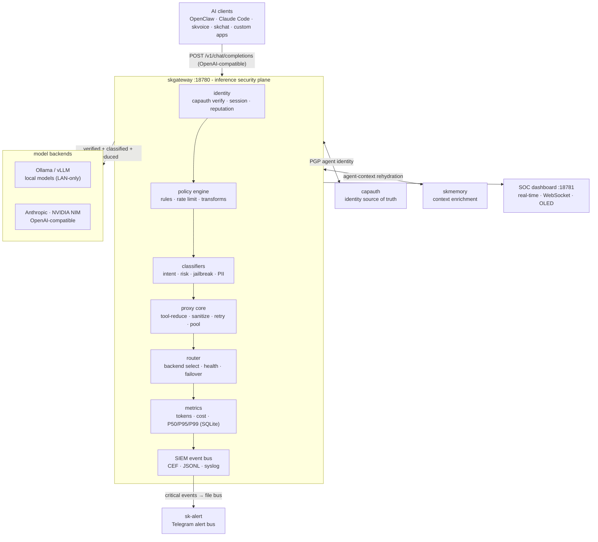

# SKGateway - Standard Operating Procedures

SKGateway is the enterprise AI inference proxy ("BlueCoat for AI"): a transparent,
auditing gateway on `:18780` that every prompt and completion passes through for
identity verification, policy enforcement, classification, model routing, metrics,
and SIEM logging. It is the SKWorld unified inference gateway and Hermes provider.

Status: Active
Maturity-tier: T0 - N/A (no key material; see §9)
Version: derived from the git tag at publish time, see §9. Do not trust the `0.1.0`
that `package.json` and `GET /status` still report.
Repo visibility: **private**. Licence: **MIT** (`LICENSE`, `package.json` `"license": "MIT"`).
Canonical-home: https://github.com/smilinTux/skgateway

## 1. Overview

Purpose: sit between any AI client and any LLM backend as a sovereign, self-hosted
chokepoint. Every request is identity-stamped (CapAuth), policy-checked, classified
(intent / risk / jailbreak / PII), tool-reduced, routed to a backend, sanitized,
metered, and logged before a response returns.

What it owns:
- The OpenAI-compatible proxy surface on `:18780` and the SOC dashboard on `:18781`.
- Backend routing and failover across Anthropic, NVIDIA NIM, Ollama, OpenAI-compatible,
  and custom vLLM backends.
- The policy engine, classifiers, per-agent rate limits, metrics (SQLite), and the
  SIEM event bus.

What it explicitly does NOT do:
- It is not an identity authority. It consumes CapAuth PGP identities; it does not
  generate, sign, wrap, or store key material of its own (hence T0, §9).
- It is not a model host. Inference runs on the configured backends; the gateway only
  routes, meters, and audits.
- It is not a persistent message store. Metrics and audit logs are retained per config;
  prompt bodies are not archived beyond the SIEM audit trail the operator configures.

## 2. Architecture

Clients speak **either** the OpenAI Chat Completions wire format **or** the Anthropic
Messages wire format to the proxy on `:18780`. The request flows through a fixed
pipeline; any stage may short-circuit with a 403/429.

**Two front-end wire formats, one pipeline.** `POST /v1/messages` accepts the Anthropic
Messages format, translates it to the OpenAI shape, routes it down the *same* path as
`/v1/chat/completions`, and translates the buffered result back (re-serialising via SSE
if the client asked for `stream: true`). That is what lets a `claude` CLI with
`ANTHROPIC_BASE_URL=http://<gw>:18780` reach any gateway model, local ornith included.
The match is **by pathname**, `req.url.split("?")[0] === "/v1/messages"`
(`src/index.mjs:1347`), specifically because Claude Code posts to `/v1/messages?beta=true`;
an exact `req.url === "/v1/messages"` comparison would miss it and drop an untranslated
Anthropic body into the raw OpenAI proxy. Do not "simplify" that comparison.

The default logical role is `sk-default` (`src/classifiers/empirical.mjs:46`,
`src/classifiers/difficulty.mjs:104`); callers should ask for the role, not a concrete
model name, and let the router resolve it.



Ports and bind:
- Proxy: `:18780` (OpenAI-compatible **and** Anthropic-compatible API). This is the
  Hermes / SKWorld `sk-default` endpoint.
- Dashboard: `:18781` (SOC UI + JSON API + WebSocket).
- Bind address is `server.bind` in config, defaulting to `0.0.0.0`
  (`src/config.mjs:81`), overridable per host with `SKGATEWAY_BIND`
  (`src/config.mjs:399`). See the exposure subsection below: the `0.0.0.0` default is a
  **live, deliberate deviation** from the ingress standard, not compliance with it.

Start here (entry-point files):
- `src/index.mjs` - process entry: HTTP server, route table (`/health`, `/healthz`,
  `/status`, `/queue`, `/v1/models`, `/v1/chat/completions`, `/v1/messages`,
  `/.well-known/skworld-module.json`, `/admin/models*`), collector + dashboard wiring.
- `src/config.mjs` - config load, defaults, env-var overrides, `SIGHUP` reload.
- `src/proxy/router.mjs` - backend selection, health, failover, role-key routing.
- `src/metrics/collector.mjs` - SQLite metrics (`createMetricsCollector`).
- `src/integration.mjs` - file-based SKCapstone bridge (PubSub alerts + job tree).

### Front-end / Exposure

- **Tier:** `0 Direct`. No reverse proxy in front of it; clients hit the port directly.
- **Public `:443` routes: none.** skgateway is not published through the SKWorld ingress
  tier and there is no `skgateway.skworld.io`.
- **Bind: `0.0.0.0:18780` and `0.0.0.0:18781`, on BOTH nodes.** Verified live on `.158`
  and on `.41` (`ss -ltnp | grep ':1878'` returns `0.0.0.0:18780` / `0.0.0.0:18781` on
  each). This is the `src/config.mjs:81` default taking effect; neither host overrides
  `server.bind` or sets `SKGATEWAY_BIND`.

**⚠️ This is a KNOWN DEVIATION from
[`UNIFIED_INGRESS_STANDARD.md`](https://github.com/smilinTux/sk-standards/blob/main/standards/UNIFIED_INGRESS_STANDARD.md),
stated here rather than papered over.** The standard says bind `127.0.0.1` or the tailnet
address, never a public port. `0.0.0.0` is **all interfaces**, which is strictly broader
than "the tailnet": it includes the LAN. The deviation is deliberate (the default exists
so the gateway is reachable across the tailnet without per-host config), but "deliberate"
is not the same as "compliant", and an earlier revision of this SOP restated the rule as
though it were met. It is not.

**Blast radius, scoped honestly.** The exposure is **LAN + tailnet, not the internet**:

- Neither node has a public interface. There is no port-forward to `:18780`.
- The only inbound path from the internet is Tailscale Funnel, and Funnel publishes
  `:443`, `:8443` and `:10000` only, proxying to `localhost:8765`, `127.0.0.1:9385`,
  `100.108.59.57:7880` and `localhost:9384`. **`:18780` and `:18781` are not among
  them** (`tailscale funnel status`), so no Funnel path reaches the gateway.
- What that leaves: any host on the physical LAN, and any device on the tailnet, can
  reach the proxy and the SOC dashboard directly. Treat both as sensitive. The dashboard
  in particular exposes agent activity and metrics with no auth of its own.

**To close the deviation** on a host that does not need LAN reach, set `server.bind` to
the tailnet IP (or `127.0.0.1`), or pass `SKGATEWAY_BIND`, and restart. This SOP will
need updating in the same change: the evidence block pins the documented `0.0.0.0`
default, so changing the default fails the docs gate by design.

## 3. Build

No build step. Pure Node.js ES modules (`.mjs`), Node 20+.

```bash
git clone https://github.com/smilinTux/skgateway.git
cd skgateway
npm install          # installs better-sqlite3 (native) + js-yaml
```

Dependencies (see `package.json`): `better-sqlite3` (metrics persistence),
`js-yaml` (config + policy parsing). `better-sqlite3` compiles a native addon on
`npm install`, so a build toolchain (`node-gyp` prerequisites) must be present.

## 4. Test

```bash
npm test             # node --test --import ./tests/_setup.mjs tests/*.test.mjs
```

Locally the green bar (all suites in `tests/` passing) is the release gate. Regression
suite of note: `tests/metrics-collector.test.mjs` locks the collector config-wiring
contract (card `7e739811`) so metrics can never silently disable again.

```bash
node --test tests/metrics-collector.test.mjs   # must pass
```

### ⚠️ KNOWN GAP: CI cannot fail. Do not cite it as evidence of anything.

**There is no `ci.yml` in this repo.** `.github/workflows/` contains exactly
`publish.yml` and `secret-scan.yml`. The only test invocation anywhere in CI is inside
`publish.yml`, and it is neutralised three times over:

| Layer | What it does |
|---|---|
| `on: push: tags: ["v*"]` | The workflow **never runs on a push or a pull request.** A PR that deletes every test is green, because nothing ran. |
| `run: npm test 2>/dev/null \|\| true` | Even on a tag, a red suite is swallowed. `2>/dev/null` also hides the failure output. |
| `continue-on-error: true` on the `test` job | Belt and braces on the same job. |
| `publish-npm` has `needs: test` **plus** `if: always()` | The `needs:` edge is decorative. A total test failure still publishes to npm. |

So: **a green checkmark on this repo certifies that a tag was pushed, and nothing more.**
No test result is behind it. Never quote skgateway CI as proof that a change is safe,
and never write a `docs-evidence` check that greps a workflow here as though it were a
gate. Run `npm test` locally and read the output.

Fixing this is owned by coordination card `62a5256d` ("ci(skskills,skgateway): test jobs
that can never fail, and publish anyway"). The fix is a real `ci.yml` on `push` +
`pull_request` running `npm test` with no `|| true`, no `2>/dev/null`, and no
`continue-on-error`. Until that lands, this section is the honest statement of the gate:
there isn't one in CI.

## 5. Release / Deploy

SKGateway is a Node.js service. Deploy as a systemd unit.

```bash
cp scripts/skgateway.service ~/.config/systemd/user/
systemctl --user daemon-reload
systemctl --user enable --now skgateway

# Reload config (backends / policies) without dropping connections:
systemctl --user kill -s HUP skgateway     # or: kill -HUP <pid>
```

### ⚠️ What actually runs on the live nodes

Two things about the live deployment are invisible from this repo, and both bite.

**1. The effective `ExecStart` has no `--config`.** The base unit hardcodes it; a
drop-in strips it back off:

| | Command |
|---|---|
| Base unit `~/.config/systemd/user/skgateway.service` | `/usr/bin/node ~/clawd/skcapstone-repos/skgateway/src/index.mjs --port 18780 --config ~/clawd/skcapstone-repos/skgateway/config/skgateway.yaml` |
| Drop-in `skgateway.service.d/config-path.conf` | clears `ExecStart=` (the empty assignment resets the list-typed setting) and re-declares it **without** `--config` |
| **Effective, both nodes** | `/usr/bin/node /home/cbrd21/clawd/skcapstone-repos/skgateway/src/index.mjs --port 18780` |

That is not cosmetic. Dropping `--config` moves the service from precedence step 1 to
step 3 in §6, so it loads the **Syncthing-synced** `~/.skcapstone/gateway/skgateway.yaml`
instead of the in-repo file. Editing `config/skgateway.yaml` in the checkout and
wondering why nothing changed is the predictable symptom. Always read the effective
command, never the unit file:

```bash
systemctl --user show skgateway -p ExecStart   # the one that matters
systemctl --user cat  skgateway                # unit + every drop-in, in order
```

**2. `ExecStart` points into the shared working checkout,
`~/clawd/skcapstone-repos/skgateway`, on both nodes.** There is no build step and no
deployed artifact: the service executes the source files in that directory. So **an
uncommitted edit in that checkout is live behaviour**, immediately on the next restart,
with nothing in git recording it. Other sessions share that checkout. Never edit it to
"test something"; work in a worktree under `~/skworld-worktrees/`, commit, then pull.

### Versioning

Do **not** hand-set a version here. `publish-npm` overwrites `package.json` from the tag
(`npm version "${GITHUB_REF#refs/tags/v}" --no-git-tag-version`) at publish time, so the
tag is authoritative. Release flow: dated `CHANGELOG.md` entry, run `npm test` locally
(§4: CI will not do it for you), then tag `vX.Y.Z` and push the tag.

⚠️ The committed `package.json` version and the `version` string hardcoded at
`src/index.mjs:962` are **both stale** and are not updated by the publish flow. See §9.

Front-end / Exposure: see §2, including the `0.0.0.0` deviation.

## 6. Configuration / Usage

Config covers server, backends, tools, sanitizer, metrics and pricing, plus
`config/policies.yaml` (rules + rate limits). Every field has a code-level default in
`src/config.mjs`; the file only needs entries that differ. Both files hot-reload on
`SIGHUP`. Full field reference: `docs/CONFIGURATION.md`.

**Which `skgateway.yaml` gets loaded** (`resolveConfigPath`, `src/config.mjs:67`), first
match wins:

1. an explicit `--config` / function-arg override,
2. `$SKGATEWAY_CONFIG`,
3. `~/.skcapstone/gateway/skgateway.yaml` (the Syncthing-synced path), if it exists,
4. the in-repo `config/skgateway.yaml`.

`~/` is expanded in 1 and 2, because `systemd Environment=` does not expand it.

⚠️ **On the live nodes the effective command passes no `--config`** (see §5), so
resolution starts at step 2 and in practice lands on **step 3, the synced file**. The
in-repo `config/skgateway.yaml` is the pre-migration fallback and is almost certainly
*not* what the running service read. Confirm with
`systemctl --user show skgateway -p ExecStart` before you edit anything.

Secrets sourcing (never inline a live secret):
- Backend API keys are referenced by env-var NAME, not value. Config carries
  `api_key_env: NVIDIA_API_KEY`; the process reads the key from the environment at
  request time. No key is ever written into `skgateway.yaml`.
- Supply those env vars to the service via a systemd `EnvironmentFile=` drop-in
  (a mode `600` file outside the repo, or sourced from the vault), never via a
  committed file. `.env` is gitignored.
- Anthropic uses `credentials_path` (default `~/.claude/.credentials.json`), read from
  disk, never copied into config.
- Env-var overrides (e.g. `SKGATEWAY_CONFIG`, `SKGATEWAY_NVIDIA_KEY_ENV`) are documented
  in `src/config.mjs`.

## 7. API / Reference

Proxy (`:18780`):

| Method | Path | Description |
|---|---|---|
| `POST` | `/v1/chat/completions` | Chat completions (SSE streaming + JSON). OpenAI-compatible. |
| `POST` | `/v1/messages` | **Anthropic-compatible** Messages surface. Translated to the OpenAI shape and routed down the same pipeline, then translated back (`src/index.mjs:1347`). Matched by **pathname**, so `?beta=true` from Claude Code still hits it. |
| `GET`  | `/v1/models` | Aggregated model catalog across configured backends. |
| `GET`  | `/v1/models/<id>` | Single-model detail. |
| `GET`  | `/health`, `/healthz` | Liveness: `{ status, uptime, backends }` (`src/index.mjs:935`). |
| `GET`  | `/status` | Self-report: `{ status, version, uptime, backends, pool, metrics }`. `metrics` is the collector's `getStats()` or `null` if disabled. ⚠️ `version` is hardcoded, see §9. |
| `GET`  | `/queue` | Connection-pool / queue depth per backend. |
| `GET`  | `/.well-known/skworld-module.json` | SKWorld module self-description (`src/index.mjs:929`). |
| `GET`  | `/admin/models`, `/admin/models/status`, `/admin/models/rank` | Model catalog administration (read). |
| `PUT`  | `/admin/models/advertise` | Advertise a model into the catalog. |
| `POST` | `/admin/models/refresh` | Force a catalog refresh. |
| `GET`  | `/`, `/dashboard` | 302 redirect to the dashboard port. |

Dashboard (`:18781`): `GET /` (SOC HTML), `GET /api/metrics`, `GET /api/metrics/history`,
`GET /api/agents`, `GET /api/events`, `GET /api/backends`, `WebSocket /ws`.

Self-report / evidence: `curl -s localhost:18780/status | jq .metrics` is the
canonical check that metrics are recording (non-null object once enabled).

## 8. Troubleshooting

| Symptom | Check |
|---|---|
| `/status` shows `metrics: null` while metrics enabled | Confirm `metrics.enabled: true` in config and that `data/` is writable. Regression `7e739811` (double config dereference) is fixed and locked by `tests/metrics-collector.test.mjs`; re-run `node --test tests/metrics-collector.test.mjs`. |
| Requests 403 unexpectedly | A policy rule denied. Inspect `logs/audit.jsonl` and the dashboard Security Events panel; check `config/policies.yaml` rule order (first deny wins). |
| Requests 429 | Rate limit hit. Check `rate_limits` for the agent/model in `config/policies.yaml`. |
| Backend 4xx/5xx / model not found | `GET /v1/models` for the aggregated catalog; check backend `priority` and `models` globs and that the backend's `api_key_env` var is set in the environment. |
| `better-sqlite3` fails to load | Native addon not built for this Node version. Re-run `npm install` (needs a `node-gyp` toolchain). |
| Config edits not taking effect | Two causes, check both. (a) Config is read once at startup and only re-read on `SIGHUP`: `systemctl --user kill -s HUP skgateway`. (b) **You probably edited the wrong file.** The effective command passes no `--config`, so the service loads `~/.skcapstone/gateway/skgateway.yaml`, not the in-repo `config/skgateway.yaml`. Confirm with `systemctl --user show skgateway -p ExecStart` (§5, §6). |
| Behaviour changed and nothing was committed / a fix "disappeared" after a pull | `ExecStart` runs the source directly out of the **shared working checkout** `~/clawd/skcapstone-repos/skgateway`, with no build and no deployed artifact. An uncommitted edit there is live behaviour, and any later `git pull`/`checkout`/`reset` by another session silently erases it. `git -C ~/clawd/skcapstone-repos/skgateway status` before you conclude anything. Never edit that checkout: use a worktree, commit, then pull. |
| A green CI checkmark on a PR | It certifies nothing about tests. There is no `ci.yml`; the only test invocation lives in a tag-triggered `publish.yml` behind `\|\| true` + `continue-on-error`. Run `npm test` locally (§4, card `62a5256d`). |
| `/status` reports a version that does not match what is installed | Expected, not a bug. The string is hardcoded at `src/index.mjs:962` and is not touched by the publish flow. Use `git describe --tags --match 'v[0-9]*'` or the published npm version (§9). |
| Claude Code / `claude` CLI gets an untranslated or garbled response from `/v1/messages` | The Anthropic frontend matches by **pathname**. If someone changed `req.url.split("?")[0] === "/v1/messages"` to an exact `req.url ===` comparison, `?beta=true` requests fall through to the raw OpenAI proxy untranslated (`src/index.mjs:1347`). |
| Alerts not reaching Telegram / SKCapstone | Integrated mode needs `~/.skcapstone/` present and `SK_STANDALONE` unset. Confirm `~/.skcapstone/pubsub/topics/skgateway.<severity>/` is being written (`src/integration.mjs`). |

## 9. Maturity-tier + Version reference

- Maturity tier: **T0 - N/A (no key material).** SKGateway routes, meters, and audits
  AI traffic; it does not generate, exchange, sign, verify, wrap, or store key material.
  Identity is delegated to CapAuth. It is therefore not a crypto component under
  `SK_REPO_DOC_STANDARD` §1, and the crypto-specific doc set (`docs/crypto-architecture.md`,
  a CRYPTOGRAPHY_STANDARD compliance line) does not apply.
- VERSION_LIFECYCLE phase: Active.
- **Licence: MIT** (`LICENSE`, and `"license": "MIT"` in `package.json`). This repo is
  **private** and is **not** GPL. The 2026-08-14 fleet-wide GPL-3.0-or-later decision
  applies to repos that had no licence; it does not relicense this one.
- **SemVer: do not quote a number from this repo, all three in-tree copies are stale.**
  An earlier revision of this SOP said "0.1.0 (`package.json`; echoed by `GET /status`)".
  All of that is still literally in the tree and all of it is wrong as a statement of the
  current version:
  - `package.json` says `0.1.0`, but `publish-npm` overwrites it from the tag with
    `npm version "${GITHUB_REF#refs/tags/v}"` at publish time, so the committed value is
    never the released one.
  - `src/index.mjs:962` hardcodes `version: "0.1.0"` into the `/status` payload, and
    nothing in the publish flow updates it. **`/status` is not a usable version oracle.**
  - The newest release tag is well past `0.1.0` (`git tag --list 'v[0-9]*' | sort -V | tail -1`).

  Ask the tree or the registry, not the docs: `git describe --tags --match 'v[0-9]*'`,
  or `npm view skgateway version`. Making `/status` report the real version is a genuine
  code fix and out of scope for a docs pass; it is noted here so nobody trusts the
  number in the meantime.
- **Test posture: no CI gate exists.** See the §4 gap and card `62a5256d`. Any "verified
  by CI" claim about this repo is false today.
- Secret posture: API keys sourced by env-var reference (§6), never inlined; `.env`
  gitignored. Transport security for cloud backends is provided by the backend URL
  (HTTPS); local backends stay on the LAN.
- **Network posture: binds `0.0.0.0` on both nodes**, a stated deviation from the
  unified ingress standard, scoped to LAN + tailnet (no Funnel path, no public
  interface). Full analysis in §2 "Front-end / Exposure".

---

<!-- docs-evidence
verified: 2026-08-15
checks:
  - name: documented ports and the 0.0.0.0 bind default are still the code defaults
    run: grep -qxF '    port: 18780,' src/config.mjs && grep -qxF '    dashboard_port: 18781,' src/config.mjs && grep -qxF "    bind: '0.0.0.0'," src/config.mjs
  - name: Anthropic /v1/messages frontend is still matched by PATHNAME, never an exact url compare
    run: grep -qF 'req.url.split("?")[0] === "/v1/messages"' src/index.mjs && ! grep -qF 'req.url === "/v1/messages"' src/index.mjs
  - name: licence is MIT and this private repo was not relicensed to GPL
    run: grep -qxF '  "license": "MIT"' package.json && head -1 LICENSE | grep -qxF 'MIT License' && ! grep -qi 'GNU GENERAL PUBLIC LICENSE' LICENSE
  - name: the documented CI gap still holds (no ci.yml; publish.yml is tags-only and swallows npm test)
    run: test ! -f .github/workflows/ci.yml && grep -qxF '      - run: npm test 2>/dev/null || true' .github/workflows/publish.yml && grep -qxF '    tags:' .github/workflows/publish.yml && ! grep -qE '^\s*(pull_request|branches):' .github/workflows/publish.yml
  - name: documented health and self-description routes still exist
    run: grep -qF 'req.url === "/health" || req.url === "/healthz"' src/index.mjs && grep -qF 'req.url === "/.well-known/skworld-module.json"' src/index.mjs && grep -qF 'req.url === "/status"' src/index.mjs && grep -qF 'req.url === "/queue"' src/index.mjs
  - name: config precedence (explicit then SKGATEWAY_CONFIG then the synced path) is unchanged
    run: grep -qF 'if (explicit) return expandHome(explicit);' src/config.mjs && grep -qF 'if (process.env.SKGATEWAY_CONFIG) return expandHome(process.env.SKGATEWAY_CONFIG);' src/config.mjs && grep -qxF "export const SYNCED_CONFIG_PATH = resolve(homedir(), '.skcapstone', 'gateway', 'skgateway.yaml');" src/config.mjs
  - name: sk-default is still the default logical role
    run: grep -qxF 'const DEFAULT_ROLE = "sk-default";' src/classifiers/empirical.mjs && grep -qxF 'const DEFAULT_DEFAULT_ROLE = "sk-default";' src/classifiers/difficulty.mjs
  - name: the stale hardcoded /status version documented in section 9 is still stale (fix it and update section 9)
    run: grep -qxF '      version: "0.1.0",' src/index.mjs
-->
