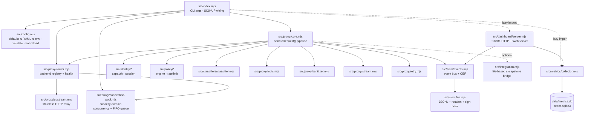
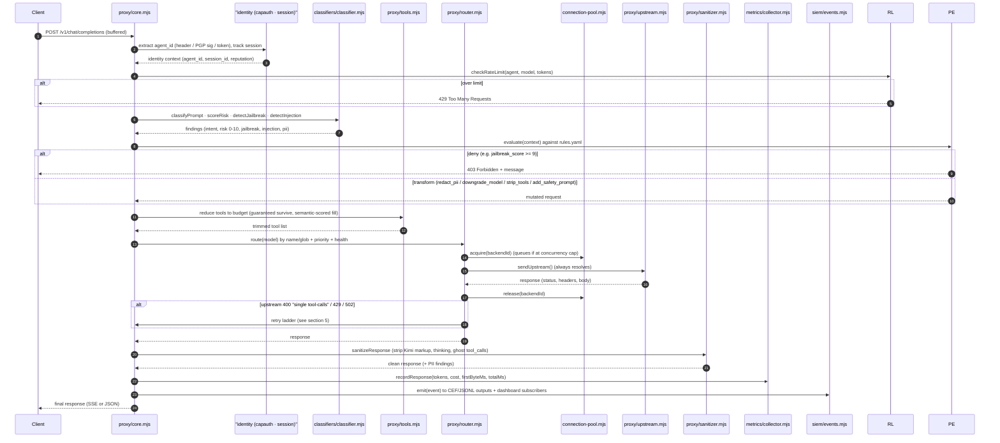
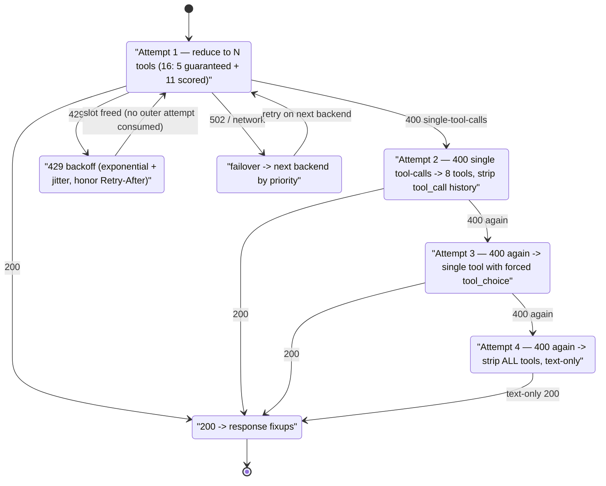
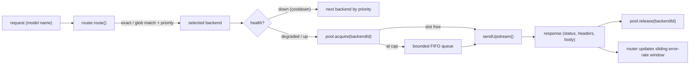
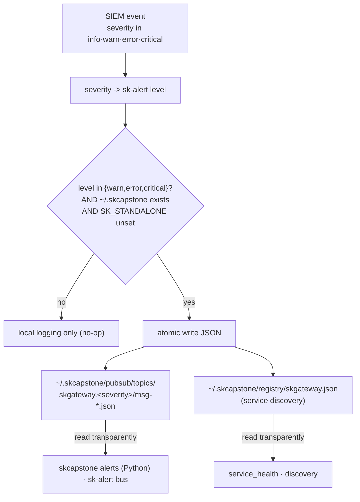
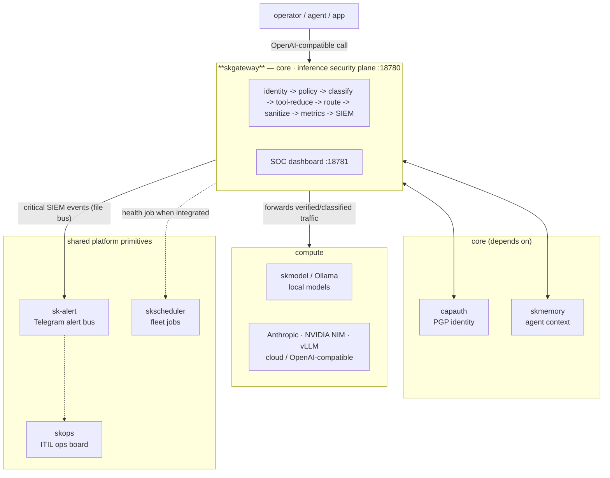

# SKGateway — Architecture

> The enterprise AI inference proxy: how a single prompt travels from any client,
> through identity → policy → classification → tool-reduction → routing → upstream →
> sanitization → metrics → SIEM, and back — on hardware you own.

This document is the precise companion to the [README](../README.md). The README tells you
*what* SKGateway does; this tells you *how*, module by module, with the request lifecycle,
the retry state machine, and a source map grounded in the actual code under `src/`.

---

## 1. The one-paragraph mental model

SKGateway is a **transparent OpenAI-compatible HTTP proxy** that speaks `/v1/chat/completions`
on `:18780` and serves a real-time SOC dashboard on `:18781`. It is a single Node.js process
(no build step, ES modules, Node 20+). Every inbound request is buffered, identified
(CapAuth), policy-checked, classified for risk, trimmed to a tool budget, routed to a healthy
backend with retry/failover, then the response is sanitized, costed, and emitted as a
structured SIEM event — all before the bytes reach the client. Nothing depends on an external
database (metrics persist to local SQLite) or an external broker (SIEM outputs are
file/syslog; skcapstone integration is file-based).

---

## 2. Process & subsystem topology

`src/index.mjs` is the entrypoint. It parses `--port`/`--config`, loads the merged config,
constructs the router and connection pool, then **lazily** imports the optional subsystems
(metrics collector, dashboard) so a minimal proxy can run even before those are configured.

**Key design choices visible in the code:**

- **Lazy optional subsystems** — `index.mjs` wraps the metrics collector and dashboard imports
  in `try/catch`, logging "not available (optional)" rather than crashing. The proxy is the
  only mandatory subsystem.
- **Stateless upstream relay** — `upstream.mjs` (`sendUpstream`) holds *no* retry or circuit
  logic; it always **resolves** (even on network error, with a synthetic `502`) so the caller's
  retry loop handles every failure uniformly. All policy lives in `core.mjs`/`retry.mjs`.
- **No build, no framework** — raw `node:http`, raw WebSocket (RFC 6455 framing in
  `dashboard/server.mjs`), `js-yaml` for config, `better-sqlite3` for metrics. That's the
  entire dependency surface.

---

## 3. Configuration: defaults ⊕ YAML ⊕ env, with hot reload

`config.mjs` is an `EventEmitter`. On `loadConfig()` it deep-merges hard-coded `DEFAULTS`
with `config/skgateway.yaml` (or `$SKGATEWAY_CONFIG`), applies env overrides
(`SKGATEWAY_PORT`, `SKGATEWAY_TARGET`, …), validates, and registers a **SIGHUP** handler.
On `kill -HUP <pid>` the file is re-read and a `config-changed` event fires — connections in
flight are never dropped. `~`-paths are expanded against the real home directory.

This is why the README's "edit a policy, send SIGHUP, no restart" workflow works: the policy
engine and rate limiter re-read their rule sets from the new config object on the
`config-changed` event.

---

## 4. The request lifecycle

Every `POST /v1/chat/completions` flows through the pipeline below. Any stage that produces a
`deny` (policy) or hard limit (rate limit, jailbreak ≥ 9) **short-circuits** and returns a
`403`/`429` without ever contacting a backend. Stages marked *flag-not-block* (classifier, PII
detection) only attach findings to the request context — enforcement is the policy engine's
job.

### Identity resolution (`identity/capauth.mjs`)

Agent identity is resolved, in order, from: `X-Agent-Id` (simple name), `X-CapAuth-Signature`
(PGP challenge-response, verified against the agent's known public key — no corporate
middleman), `Authorization: Bearer <tok>` (token→agent via registry), or `X-Session-Id`
(correlation only). The agent registry is loaded from config **or auto-discovered** from
`~/.skcapstone/agents/*/`. The resolved `agent_id` is stamped onto the request context so the
policy engine, rate limiter, metrics, and SIEM all key off the *same* identity.

### Sessions (`identity/session.mjs`)

Sessions are keyed by `X-Session-Id`; when absent, one is auto-generated per
`(agent_id, request_id)`. Each session tracks `start_time`, `request_count`, `token_total`,
and `last_active`, with a periodic sweep GC that expires idle sessions (default 30 min) so
memory stays bounded.

### Classification (`classifiers/classifier.mjs`)

Zero ML dependencies — pure regex/keyword scoring compiled at module load to meet a
**<5 ms per-call** budget. Four pure functions: `classifyPrompt` (intent category),
`scoreRisk` (0–10), `detectJailbreak` (pattern families, multi-turn escalation via read-only
history), `detectInjection` (prompt-injection signatures). All return structured findings;
none block — the policy engine decides.

---

## 5. The retry / failover state machine

The single hardest-won piece of the codebase. `core.mjs` (with `retry.mjs`) implements a
layered retry strategy learned from production NVIDIA NIM / Anthropic / Ollama behavior.
For tool-carrying `/chat/completions` requests:

**429s are special:** exponential backoff with jitter happens *inside* an attempt and honors
the `Retry-After` header — it does **not** consume one of the four outer attempts.
`retry.mjs` additionally tracks **per-backend circuit breakers** (open → half-open → closed)
so a flapping backend is shed before it burns retry budget.

### Response fixups (applied to every `200` with tools)

`core.mjs` post-processes successful responses to paper over backend quirks:

1. **Content sanitization** — strip leaked model markup (e.g. Kimi K2.5
   `<|tool_calls_section_begin|>`) and `<thinking>` blocks (`sanitizer.mjs`).
2. **Reasoning promotion** — move a `reasoning` field into `content` when content is empty.
3. **Empty-content fallback** — inject a fallback message so the client always gets text.
4. **Ghost tool-call fix** — `finish_reason: "tool_calls"` with no `tool_calls` becomes `"stop"`.
5. **Hallucinated tool fix** — drop `tool_calls` whose names aren't in the allowed tool set.
6. **Multi-tool trim** — keep only the first `tool_call`.
7. **Tool-round limit** — force text-only after N consecutive tool rounds (`call_limit`).

Requests **without tools** and **non-chat-completion endpoints** are relayed transparently.

---

## 6. Tool reduction (`proxy/tools.mjs`)

LLM backends degrade (or hard-error with `400 single tool-calls`) when handed too many tools.
The tool reducer trims a large tool array (the README cites ~94) down to `max_budget`
(default 16): a **guaranteed** set (`exec`, `read`, `write`, `edit`, `message`) always
survives, and the remaining budget is filled by **semantic keyword scoring** of each tool's
name/description against the prompt. When routing finds no match it falls back to
`fallback_budget` (default 8). `call_limit` caps consecutive tool-call rounds per request.
This is what lets a 94-tool agent talk to a backend that only tolerates ~16.

---

## 7. Routing, pooling & upstream relay

- **`router.mjs`** keeps a registry of backends and a **sliding error-rate window** (last 100
  requests). Crossing 10% marks a backend *degraded*; 50% marks it *down* and starts a 60 s
  cooldown, after which one probe request promotes it back to *degraded*. Backends are tried in
  ascending `priority`. Runtime `addBackend`/`removeBackend` are supported.
- **`connection-pool.mjs`** enforces concurrency per explicit capacity domain,
  falling back to one domain per backend. This prevents direct and registry
  aliases for one physical service from multiplying its limit. Excess requests
  wait in a bounded FIFO queue; abort removes a waiter immediately, and
  `/queue` exposes configured domains even while idle plus timeout, drop, and
  cancellation counters. Each admitted slot has a pool-owned, single-use
  object ticket; release by string, copy, duplicate, or foreign pool is inert.
- **`upstream.mjs`** is the only module that does network I/O to the model. It buffers the full
  response, strips hop-by-hop headers, and **always resolves** (synthetic `502` on failure).

---

## 8. Observability: metrics & SIEM

### Metrics (`metrics/collector.mjs`)

Parses token counts from every response and aggregates by `agent_id / model / backend /
session_id / hour / day`. Cost = tokens × per-model pricing from config. Latency percentiles
(P50/P95/P99) are computed with the streaming **P² algorithm** (no unbounded history).
Persistence is **batched** to `data/metrics.db` (better-sqlite3) every 5 s or 100 events, with
auto-purge of rows past `retention_days` (default 90). A rolling 5-minute in-memory window
feeds the live dashboard.

### SIEM event bus (`siem/events.mjs` + `siem/file.mjs`)

`events.mjs` is an in-memory pub/sub bus. `createEvent()` stamps a typed event
(`auth`, `request`, `response`, `error`, `policy_violation`, `anomaly`, `failover`,
`tool_use`); `formatCEF()` renders ArcSight CEF for enterprise SIEM ingestion; `emit()` fans
out to subscribers **and** registered output adapters (any `{ write(event) }`). `file.mjs` is
the JSONL adapter: newline-delimited events, rotation at `rotate_mb` (default 100 MB) with
timestamped filenames, `keep_files` retention (default 10), batched flushing, and a
**PGP-signing hook** (`_signRotated`) wired for SKSecurity-style audit-log signing.

---

## 9. SOC dashboard (`dashboard/server.mjs`)

A second `node:http` server on `:18781` (no Express). It serves the static SPA from
`src/dashboard/static/` and exposes REST endpoints (`/api/stats`, `/api/tokens`,
`/api/costs`, `/api/events`, `/api/health`, `/api/agents`) plus a **raw WebSocket** (RFC 6455
framing, no `ws` dependency) that pushes a full `stats` payload every 5 s to all connected
clients. The UI is OLED-black glass-morphism with Canvas-rendered charts and per-agent accent
colors matched to soul color assignments.

---

## 10. skcapstone integration (`integration.mjs`) — optional, polyglot, file-based

SKGateway is a **Node** service and cannot import the **Python** `skcapstone.sdk`. So it
integrates the *same way the Python SDK actually does* — by reading/writing the shared,
Syncthing-synced file tree under `~/.skcapstone/`. This makes integration zero-broker and
daemon-independent.

| Mode | Trigger | Behavior |
|---|---|---|
| **Standalone** | `SK_STANDALONE=1`, or `~/.skcapstone/` absent | `alert()` is a no-op; native `skgateway.service` only |
| **Integrated** | `~/.skcapstone/` present and `SK_STANDALONE` unset | File-based sk-alert publish + service-discovery registration |

Topics follow the `sk*` convention `skgateway.<severity>`; the semantic event name lives in
the payload `event` field, not the topic suffix. `info`-level events are dropped from the bus
(local-only). The Node↔Python round-trip is validated in `tests/integration.test.mjs`.

---

## 11. Source map

| Module | Role |
|---|---|
| `src/index.mjs` | Entrypoint — CLI args, config load, subsystem wiring, lazy optional imports |
| `src/config.mjs` | YAML loader: defaults ⊕ file ⊕ env, validation, `~` expansion, SIGHUP hot-reload |
| `src/integration.mjs` | Optional file-based skcapstone bridge (sk-alert publish + service discovery) |
| `src/proxy/core.mjs` | The pipeline + retry ladder + response fixups; `handleRequest()` / `createProxyServer()` |
| `src/proxy/router.mjs` | Backend registry, name/glob+priority selection, sliding-window health, failover |
| `src/proxy/connection-pool.mjs` | Capacity-domain concurrency cap + bounded FIFO admission + queue outcome stats |
| `src/proxy/upstream.mjs` | Stateless HTTP/HTTPS relay; always resolves (synthetic 502 on failure) |
| `src/proxy/tools.mjs` | Tool reduction — guaranteed set + semantic keyword scoring to a budget |
| `src/proxy/sanitizer.mjs` | Response/request sanitization, PII detection (Luhn), DLP pattern scan |
| `src/proxy/stream.mjs` | SSE primitives: `SSEWriter`, `jsonToSSE`, `SSEParser`, `passthroughStream` |
| `src/proxy/retry.mjs` | 4-layer retry/failover, backoff+jitter, per-backend circuit breakers |
| `src/identity/capauth.mjs` | Agent identity extraction (header / PGP sig / token), registry, enrichment middleware |
| `src/identity/session.mjs` | Session lifecycle, per-agent indexing, idle-timeout sweep |
| `src/classifiers/classifier.mjs` | Intent / risk(0–10) / jailbreak / injection — regex, <5 ms, flag-not-block |
| `src/metrics/collector.mjs` | Token/cost/latency aggregation, P² percentiles, batched SQLite persistence |
| `src/siem/events.mjs` | Event bus + factory + CEF formatter; pluggable output adapters |
| `src/siem/file.mjs` | JSONL audit output: rotation, retention, batched flush, PGP-sign hook |
| `src/dashboard/server.mjs` | `:18781` HTTP REST + raw WebSocket push; serves `static/` SPA |
| `src/dashboard/static/index.html` | OLED SOC SPA — Canvas charts, per-agent colors |
| `config/skgateway.yaml` | Server, backends, tools, sanitizer, metrics/pricing, SIEM outputs |
| `config/policies.yaml` | Policy rules + rate-limit definitions (hot-reloadable) |
| `scripts/skgateway.service` | systemd `--user` unit |
| `tests/*.test.mjs` | `node --test`: classifier, sanitizer, retry, integration round-trip |

---

## 12. Where it lives in SKStack v2

SKWorld is deployed through **skos** (the sovereign agent OS) on a ports/adapters model,
organized by the **4 C's**: **cloud · comms · compute · core**. SKGateway is a **core**
capability — the security/identity plane that *all* AI inference traffic is funneled through
on its way to the **compute** layer's model backends. It depends only on the primitives it
actually touches.

**Why core, not comms:** SKGateway is not a transport (that's `skcomms`/`skchat`/`skbus`) —
it is the policy/identity/audit chokepoint in front of inference, the same role `capauth`,
`sksec`, and `skwaf` play in the **core** band. It consumes `capauth` for identity and reports
through the shared primitives; it does not implement messaging itself.

---

Part of the **[SKWorld](https://skworld.io)** sovereign ecosystem · site:
**[skgateway.skworld.io](https://skgateway.skworld.io)** · 🐧 smilinTux
