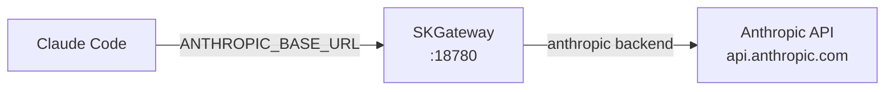

# SKGateway — Claude Code Integration Guide

This guide explains how to route Claude Code sessions through SKGateway. This gives you full visibility into Claude Code's API calls, token consumption, costs, and any security events — all tracked in the same SOC dashboard as your other agents.

---

## What This Does

Claude Code communicates with the Anthropic API over HTTPS. By pointing it at SKGateway instead, every request is intercepted, logged, and reported before being forwarded to Anthropic. From Claude Code's perspective, nothing changes — it gets the same responses it always did.



Use cases:
- See exactly how many tokens each Claude Code session uses
- Track API costs per agent or session
- Audit which files and prompts are being sent to Anthropic
- Correlate Claude Code activity with other agents in the dashboard

---

## Prerequisites

Make sure SKGateway has an `anthropic` backend configured in `config/skgateway.yaml`:

```yaml
backends:
  anthropic:
    url: https://api.anthropic.com/v1
    auth_type: oauth
    credentials_path: ~/.claude/.credentials.json
    models:
      - claude-opus-4-6
      - claude-sonnet-4-6
    priority: 2
```

Start SKGateway and verify the Anthropic backend shows as `up`:

```bash
curl -s http://localhost:18780/health | jq .backends.anthropic.status
# "up"
```

---

## Option A: Set ANTHROPIC_BASE_URL (Recommended)

Claude Code respects the `ANTHROPIC_BASE_URL` environment variable. When set, it sends all API requests to that URL instead of `https://api.anthropic.com`.

**For a single session:**

```bash
ANTHROPIC_BASE_URL=http://127.0.0.1:18780 claude
```

**For all sessions in your shell:**

Add this to your `~/.bashrc` or `~/.zshrc`:

```bash
export ANTHROPIC_BASE_URL=http://127.0.0.1:18780
```

Then reload:

```bash
source ~/.bashrc
```

Now every `claude` invocation automatically routes through SKGateway. You do not need to change anything else — your API key, OAuth credentials, and all Claude Code features work as normal.

**Verifying it worked:**

Start a Claude Code session and send a simple message. Then check the gateway stats:

```bash
curl -s http://localhost:18781/api/stats | jq '{totalRequests, recentRequests5m}'
```

The `recentRequests5m` count should increment. You can also watch the dashboard at `http://localhost:18781` in real time.

---

## Option B: MCP Server Integration (Future)

A future version of SKGateway will expose an MCP (Model Context Protocol) server that Claude Code can connect to as a tool provider. This will allow:

- Pulling live gateway metrics directly into a Claude Code session
- Triggering policy changes or agent dispatches from within Claude Code
- Querying token usage history as a tool call

When this is available, you will add SKGateway to your MCP config in `~/.claude/settings.json` like any other MCP server. The proxy-based approach (Option A) will continue to work alongside it.

---

## How Agent Identity Works

When Claude Code routes through SKGateway, requests are tagged with an agent identifier so you can distinguish Claude Code traffic from OpenClaw or other clients.

Set `SKCAPSTONE_AGENT` before starting Claude Code:

```bash
SKCAPSTONE_AGENT=opus claude
```

Or export it permanently:

```bash
export SKCAPSTONE_AGENT=opus
```

`opus` is the conventional agent name for Claude Code in the SK ecosystem (as opposed to `lumina` for OpenClaw or `jarvis` for the terminal agent). With this set, the dashboard will show a separate row for `opus` in the token chart and cost tracker.

If `SKCAPSTONE_AGENT` is not set, activity is recorded under `unknown` and still counted in the totals — it just will not appear as a named agent in the per-agent breakdowns.

---

## Viewing Claude Code Activity in the SOC Dashboard

Open `http://localhost:18781`. With Claude Code traffic flowing through the gateway:

**Header bar** — `totalRequests` and `rps` (requests per second) update in real time.

**Token Usage chart** — Select the `opus` agent from the legend to isolate Claude Code's token consumption. Switch between `1h`, `6h`, and `24h` time windows.

**Cost Tracker** — The daily cost total includes Claude Code's Anthropic calls. Opus-4.6 is billed at $15.00 per 1M input tokens and $75.00 per 1M output tokens; Sonnet-4.6 at $3.00/$15.00. These rates are configured in `skgateway.yaml` under `metrics.pricing`.

**Agent Activity Feed** — Each Claude Code request appears as a timestamped entry with the model name, token count, and latency.

**Prompt Classification** — The donut chart categorizes each prompt by intent (code generation, data query, tool use, etc.) using on-device regex classification. This runs in under 5ms and does not send prompts anywhere.

**Security Events** — Any prompt that matches jailbreak patterns or contains sensitive credential signals appears here with a severity level.

---

## Token Usage and Cost Tracking

To query Claude Code's token usage directly from the API:

```bash
# Tokens used by the opus agent in the last 24 hours
curl -s "http://localhost:18781/api/tokens?agent=opus&period=24h" | jq .rows

# All costs today
curl -s "http://localhost:18781/api/costs?period=24h" | jq .rows
```

Token data is stored in SQLite at `./data/metrics.db` and retained for 90 days by default. You can query it directly for custom reports:

```bash
sqlite3 ~/clawd/skcapstone-repos/skgateway/data/metrics.db \
  "SELECT day_bucket, SUM(input_tokens), SUM(output_tokens)
   FROM token_usage
   WHERE agent_id = 'opus'
   GROUP BY day_bucket
   ORDER BY day_bucket DESC
   LIMIT 7;"
```

---

## Stopping the Proxy

To stop routing Claude Code through SKGateway, unset the environment variable:

```bash
unset ANTHROPIC_BASE_URL
```

Or remove the `export` line from your shell profile and start a new terminal. Claude Code will go back to talking directly to Anthropic.
