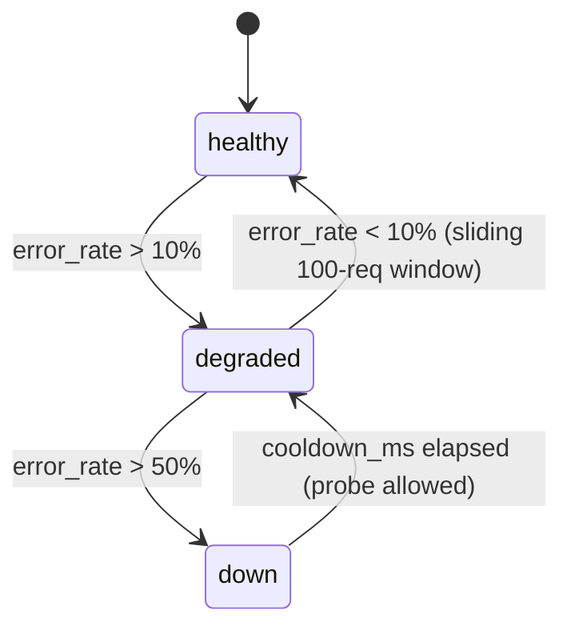

# SKGateway — Configuration Reference

## Contents

1. [Overview](#overview)
2. [Config File Location](#config-file-location)
3. [Environment Variable Overrides](#environment-variable-overrides)
4. [SIGHUP Hot-Reload](#sighup-hot-reload)
5. [Full Field Reference](#full-field-reference)
   - [server](#server)
   - [backends](#backends)
   - [tools](#tools)
   - [sanitizer](#sanitizer)
   - [metrics](#metrics)
   - [siem](#siem)
   - [dashboard](#dashboard)
   - [identity](#identity)
6. [Example Configurations](#example-configurations)
   - [Minimal — NVIDIA proxy replacement](#minimal--nvidia-proxy-replacement)
   - [Full enterprise](#full-enterprise)
   - [Local-only (Ollama, no cloud)](#local-only-ollama-no-cloud)
   - [Multi-tenant](#multi-tenant)

---

## Overview

SKGateway is configured via a single YAML file. All fields have hard-coded
defaults, so the file only needs to contain values that differ from the defaults.
The config is loaded at startup and can be reloaded without restart by sending
`SIGHUP` to the process.

Config is loaded with deep-merge semantics: nested objects in your file are
merged over the defaults key-by-key. Arrays in your file **replace** (not
append to) the corresponding default array.

---

## Config File Location

The default path is `./config/skgateway.yaml` (relative to the working
directory). Override with the `SKGATEWAY_CONFIG` environment variable or the
`--config` CLI flag:

```bash
# Environment variable
SKGATEWAY_CONFIG=/etc/skgateway/config.yaml node src/index.mjs

# CLI flag
node src/index.mjs --config /etc/skgateway/config.yaml
```

The `~` prefix in path values (e.g. `~/.claude/.credentials.json`) is expanded
to the process owner's home directory.

---

## Environment Variable Overrides

These environment variables are checked at config load time. They take
precedence over values in the YAML file.

| Variable | Config equivalent | Description |
|----------|------------------|-------------|
| `SKGATEWAY_CONFIG` | _(config path)_ | Path to the YAML config file |
| `SKGATEWAY_PORT` | `server.port` | Proxy listen port |
| `SKGATEWAY_TARGET` | _(legacy single-backend)_ | Upstream base URL (legacy; use `backends:` instead) |
| `NVIDIA_PROXY_PORT` | `server.port` | Legacy alias for `SKGATEWAY_PORT` |
| `NVIDIA_PROXY_TARGET` | _(legacy)_ | Legacy alias for `SKGATEWAY_TARGET` |
| `NVIDIA_API_KEY` | _(read by nvidia backend)_ | NVIDIA NIM API key |
| `ANTHROPIC_API_KEY` | _(read by anthropic backend if auth\_type=api\_key)_ | Anthropic API key |
| `SKCAPSTONE_AGENT` | _(used by identity middleware)_ | Default agent identity when no header is present |

Backend API keys are read from environment variables named by the `api_key_env`
field of each backend config (see [backends](#backends)). They are never stored
in the YAML file.

---

## SIGHUP Hot-Reload

Send `SIGHUP` to the gateway process to reload the YAML config and policy files
without restarting:

```bash
# By PID
kill -HUP $(pgrep -f skgateway)

# By process name (if using a process manager)
pkill -HUP skgateway
```

What gets reloaded on SIGHUP:
- All YAML config values (server ports, backend URLs, tool budgets, sanitizer
  limits, metrics settings, SIEM outputs)
- Policy rules from `config/policies.yaml`
- Tool groups under `tools.groups`
- Model pricing tables

What does NOT reload without restart:
- Already-open TCP server sockets (port changes require restart)
- SQLite database connection (db\_path changes require restart)
- SIEM output adapters that maintain open file handles (file rotation is
  handled internally; path changes require restart)

The config module emits a `config-changed` event on successful reload.
Subsystems that subscribe to this event update their internal state automatically.

---

## Full Field Reference

### `server`

Top-level server bind settings.

```yaml
server:
  port: 18780
  dashboard_port: 18781
  bind: 0.0.0.0
```

| Field | Type | Default | Description |
|-------|------|---------|-------------|
| `port` | integer | `18780` | Port the proxy HTTP server listens on. The proxy handles `/v1/chat/completions`, `/health`, and `/status` on this port. |
| `dashboard_port` | integer | `18781` | Port the SOC dashboard HTTP server and WebSocket listens on. Set to `0` to disable the dashboard. |
| `bind` | string | `"0.0.0.0"` | Network interface to bind. Use `"127.0.0.1"` to restrict to loopback only. |

---

### `backends`

Registry of upstream LLM endpoints. Each key becomes the backend's identifier
(`backend` field in logs and policy conditions).

```yaml
backends:
  nvidia:
    url: https://integrate.api.nvidia.com/v1
    auth_type: api_key
    api_key_env: NVIDIA_API_KEY
    models:
      - kimi-k2-instruct
      - kimi-k2.5
      - minimax-m2.1
    priority: 1

  anthropic:
    url: https://api.anthropic.com/v1
    auth_type: oauth
    credentials_path: ~/.claude/.credentials.json
    models:
      - claude-opus-4-6
      - claude-sonnet-4-6
    priority: 2

  ollama:
    url: http://192.168.0.100:11434/v1
    auth_type: none
    models:
      - "dolphin-*"
    priority: 3
```

**Per-backend fields:**

| Field | Type | Default | Description |
|-------|------|---------|-------------|
| `url` | string | _(required)_ | Base URL of the upstream API including the `/v1` suffix. |
| `auth_type` | enum | `"api_key"` | Authentication strategy. One of `api_key`, `oauth`, `bearer`, `none`. |
| `api_key_env` | string | — | Name of the environment variable holding the API key. Used when `auth_type: api_key`. |
| `token_env` | string | — | Name of the environment variable holding a bearer token. Used when `auth_type: bearer`. |
| `credentials_path` | string | — | Path to a JSON credentials file (e.g. `~/.claude/.credentials.json`). Used when `auth_type: oauth`. The file must contain `{ "access_token": "..." }` (refreshed externally). |
| `models` | string[] | `[]` | List of model IDs or glob patterns this backend serves. The router matches the request's `model` field against this list. Glob patterns use `*` as wildcard. |
| `priority` | integer | `99` | Backend selection order. Lower number = higher priority. When multiple backends can serve a model, the lowest-priority backend is tried first. |
| `cooldown_ms` | integer | `60000` | Duration (ms) a backend stays in "down" state before being re-probed. |
| `health_path` | string | `"/health"` | URL path used for liveness probe requests during backend recovery. |
| `failover_model` | string | — | Model to use on the same backend when the requested model is unavailable. |
| `model_aliases` | object | `{}` | Map of client-requested model IDs to backend-actual model IDs. Applied before forwarding. |

**Backend health states:**



---

### `tools`

Controls the tool reduction and semantic routing engine.

```yaml
tools:
  guaranteed:
    - exec
    - read
    - write
    - edit
    - message
  max_budget: 16
  fallback_budget: 8
  call_limit: 10
  groups:
    "my_keyword|another_word":
      - my_tool_one
      - my_tool_two
```

| Field | Type | Default | Description |
|-------|------|---------|-------------|
| `guaranteed` | string[] | `["exec","read","write","edit","message"]` | Tools that always survive reduction. These are always included in the forwarded tool list regardless of budget. |
| `max_budget` | integer | `16` | Maximum number of tools forwarded on the first attempt. If the client sends more tools, the proxy reduces to this count using semantic scoring. |
| `fallback_budget` | integer | `8` | Tool count used on the second retry attempt (after a `400 "single tool-calls"` error). |
| `call_limit` | integer | `10` | Maximum number of consecutive tool-call rounds in a single conversation. After this many consecutive tool calls, the proxy strips tools from the next request to force a text response. |
| `groups` | object | _(built-in defaults)_ | Custom semantic keyword groups. Keys are pipe-delimited regex alternation patterns (case-insensitive). Values are arrays of tool names to boost when any keyword matches. Custom groups are merged over the built-in defaults. |

**Retry escalation by tool budget:**

```
Attempt 1: max_budget tools (16 default)
Attempt 2: fallback_budget tools (8 default), tool_call history stripped
Attempt 3: 1 tool, forced tool_choice
Attempt 4: 0 tools (text-only)
```

---

### `sanitizer`

Controls request trimming and response cleaning.

```yaml
sanitizer:
  max_system_bytes: 40000
  max_body_bytes: 120000
  keep_start: 2
  keep_end: 12
  strip_thinking: true
```

| Field | Type | Default | Description |
|-------|------|---------|-------------|
| `max_system_bytes` | integer | `40000` | Maximum total byte length of all system messages combined. System messages exceeding this limit are truncated from the end. |
| `max_body_bytes` | integer | `120000` | Maximum byte length of the entire messages array. When exceeded, conversation history is trimmed: `keep_start` messages from the beginning and `keep_end` messages from the end are preserved; everything in between is removed. |
| `keep_start` | integer | `2` | Number of non-system messages to keep from the start of conversation history during trimming. Preserves the initial context. |
| `keep_end` | integer | `12` | Number of non-system messages to keep from the end of conversation history during trimming. Preserves recent context. |
| `strip_thinking` | boolean | `true` | When `true`, strips leaked chain-of-thought preamble and Kimi K2.5 `<\|tool_calls_section_begin\|>` markup from model responses. |

---

### `metrics`

Controls token tracking, cost accounting, and SQLite storage.

```yaml
metrics:
  enabled: true
  db_path: ./data/metrics.db
  retention_days: 90
  token_tracking: true
  cost_tracking: true
  pricing:
    claude-opus-4-6:
      input: 15.00
      output: 75.00
      cache_read: 1.50
      cache_write: 3.75
    claude-sonnet-4-6:
      input: 3.00
      output: 15.00
      cache_read: 0.30
      cache_write: 0.375
    kimi-k2-instruct:
      input: 0
      output: 0
    default_local:
      input: 0
      output: 0
```

| Field | Type | Default | Description |
|-------|------|---------|-------------|
| `enabled` | boolean | `true` | Master switch. When `false`, no metrics are collected and the SQLite file is not opened. |
| `db_path` | string | `"./data/metrics.db"` | Path to the SQLite database file. Parent directories are created automatically. Supports `~` expansion. |
| `retention_days` | integer | `90` | Rows older than this are deleted during the 6-hourly purge cycle. Set to `0` to disable purging. |
| `token_tracking` | boolean | `true` | When `true`, records input/output/cache token counts per request. |
| `cost_tracking` | boolean | `true` | When `true`, multiplies token counts by model pricing to compute USD cost per request. Requires `token_tracking: true`. |
| `pricing` | object | _(see defaults)_ | Per-model pricing in USD per 1,000,000 tokens. Keys are model ID prefixes (matched with `startsWith`). The special key `default_local` applies to any model not matched by another prefix. Each entry supports `input`, `output`, `cache_read`, and `cache_write` sub-fields. |

---

### `siem`

Controls structured event emission and output adapters.

```yaml
siem:
  enabled: true
  outputs:
    - type: file
      path: ./logs/audit.jsonl
      rotate_mb: 100

    - type: syslog
      host: localhost
      port: 514
      protocol: udp       # udp | tcp
      format: cef         # cef | json

    - type: elasticsearch
      url: http://localhost:9200
      index: skgateway-events
      username: elastic
      password_env: ES_PASSWORD
```

**Top-level fields:**

| Field | Type | Default | Description |
|-------|------|---------|-------------|
| `enabled` | boolean | `true` | Master switch. When `false`, no SIEM events are emitted and outputs are not opened. |
| `outputs` | array | `[{type: "file", path: "./logs/audit.jsonl", rotate_mb: 100}]` | List of output adapter configurations. All registered outputs receive every event. |

**`type: file` adapter:**

| Field | Type | Default | Description |
|-------|------|---------|-------------|
| `path` | string | `"./logs/audit.jsonl"` | File path for the JSONL audit log. Parent directories are created automatically. |
| `rotate_mb` | integer | `100` | Rotate the log file when it exceeds this size in megabytes. The rotated file is renamed with a `.1` suffix. |
| `format` | string | `"jsonl"` | Output format: `jsonl` (one JSON object per line) or `cef` (ArcSight CEF). |

**`type: syslog` adapter:**

| Field | Type | Default | Description |
|-------|------|---------|-------------|
| `host` | string | `"localhost"` | Syslog server hostname or IP. |
| `port` | integer | `514` | Syslog server port. |
| `protocol` | string | `"udp"` | Transport: `udp` or `tcp`. |
| `format` | string | `"cef"` | Payload format: `cef` or `json`. |
| `facility` | integer | `16` | RFC 5424 syslog facility code. Default 16 = local0. |

**`type: elasticsearch` adapter:**

| Field | Type | Default | Description |
|-------|------|---------|-------------|
| `url` | string | _(required)_ | Elasticsearch base URL including protocol and port. |
| `index` | string | `"skgateway-events"` | Target index name. Supports date patterns (e.g. `skgateway-{YYYY.MM.DD}`). |
| `username` | string | — | Basic auth username. |
| `password_env` | string | — | Name of the environment variable holding the Elasticsearch password. |
| `batch_size` | integer | `50` | Number of events to batch before flushing to Elasticsearch via the bulk API. |
| `flush_interval_ms` | integer | `5000` | Maximum time between Elasticsearch flushes (ms). |

---

### `dashboard`

Controls the SOC dashboard server.

```yaml
dashboard:
  enabled: true
  refresh_ms: 5000
```

| Field | Type | Default | Description |
|-------|------|---------|-------------|
| `enabled` | boolean | `true` | When `true`, starts the dashboard HTTP server on `server.dashboard_port`. |
| `refresh_ms` | integer | `5000` | How often (ms) the server pushes updated stats to WebSocket clients. |

---

### `identity`

Controls CapAuth integration and agent identity requirements.

```yaml
identity:
  require_agent_id: false
  allow_anonymous: true
  capauth_verify: false
```

| Field | Type | Default | Description |
|-------|------|---------|-------------|
| `require_agent_id` | boolean | `false` | When `true`, requests without a recognizable agent identity are rejected with HTTP 401. |
| `allow_anonymous` | boolean | `true` | When `false` and `require_agent_id: true`, requests that can't be mapped to a known agent are rejected. When `true`, they proceed as the `anonymous` agent. |
| `capauth_verify` | boolean | `false` | When `true`, the gateway cryptographically verifies the `X-CapAuth-Signature` header using the agent's registered PGP public key. Requests with invalid signatures are rejected. |

---

## Example Configurations

### Minimal — NVIDIA proxy replacement

Drop-in replacement for the legacy `nvidia-proxy.mjs`. Handles tool reduction
and SSE conversion only.

```yaml
server:
  port: 18780
  bind: 127.0.0.1

backends:
  nvidia:
    url: https://integrate.api.nvidia.com/v1
    auth_type: api_key
    api_key_env: NVIDIA_API_KEY
    models:
      - "kimi-k2-instruct"
      - "kimi-k2.5"
      - "minimax-m2.1"
    priority: 1

tools:
  max_budget: 16
  fallback_budget: 8
  call_limit: 10

metrics:
  enabled: false

siem:
  enabled: false

dashboard:
  enabled: false
```

Start with:

```bash
NVIDIA_API_KEY=nvapi-xxx node src/index.mjs --config config/minimal.yaml
```

---

### Full enterprise

All backends enabled, SIEM forwarding to file + syslog + Elasticsearch, policy
enforcement, dashboard active.

```yaml
server:
  port: 18780
  dashboard_port: 18781
  bind: 0.0.0.0

backends:
  nvidia:
    url: https://integrate.api.nvidia.com/v1
    auth_type: api_key
    api_key_env: NVIDIA_API_KEY
    models: [kimi-k2-instruct, kimi-k2.5, minimax-m2.1]
    priority: 1

  anthropic:
    url: https://api.anthropic.com/v1
    auth_type: oauth
    credentials_path: ~/.claude/.credentials.json
    models: [claude-opus-4-6, claude-sonnet-4-6]
    priority: 2

  ollama:
    url: http://192.168.0.100:11434/v1
    auth_type: none
    models: ["dolphin-*", "llama3-*"]
    priority: 3

tools:
  guaranteed: [exec, read, write, edit, message]
  max_budget: 16
  fallback_budget: 8
  call_limit: 10

sanitizer:
  max_system_bytes: 40000
  max_body_bytes: 120000
  keep_start: 2
  keep_end: 12
  strip_thinking: true

metrics:
  enabled: true
  db_path: /var/lib/skgateway/metrics.db
  retention_days: 90
  token_tracking: true
  cost_tracking: true
  pricing:
    claude-opus-4-6:    { input: 15.00,  output: 75.00,  cache_read: 1.50,  cache_write: 3.75 }
    claude-sonnet-4-6:  { input: 3.00,   output: 15.00,  cache_read: 0.30,  cache_write: 0.375 }
    kimi-k2-instruct:   { input: 0,      output: 0 }
    default_local:      { input: 0,      output: 0 }

siem:
  enabled: true
  outputs:
    - type: file
      path: /var/log/skgateway/audit.jsonl
      rotate_mb: 100
      format: jsonl
    - type: syslog
      host: syslog.internal
      port: 514
      protocol: udp
      format: cef
    - type: elasticsearch
      url: http://elasticsearch:9200
      index: skgateway-events
      username: skgateway
      password_env: ES_PASSWORD

dashboard:
  enabled: true
  refresh_ms: 5000

identity:
  require_agent_id: false
  allow_anonymous: true
  capauth_verify: false
```

---

### Local-only (Ollama, no cloud)

For a fully air-gapped or privacy-first deployment. All inference stays on the
local network. No API keys needed.

```yaml
server:
  port: 18780
  bind: 127.0.0.1

backends:
  ollama_primary:
    url: http://192.168.0.100:11434/v1
    auth_type: none
    models:
      - "dolphin-mixtral:8x7b"
      - "llama3.3:70b"
      - "qwen2.5-coder:32b"
      - "*"          # catch-all for local models
    priority: 1

tools:
  guaranteed: [exec, read, write, edit, message]
  max_budget: 20    # local models are more tolerant of large tool lists
  fallback_budget: 10
  call_limit: 15

sanitizer:
  max_system_bytes: 80000   # larger limit — no API cost for system prompts
  max_body_bytes: 200000
  keep_start: 4
  keep_end: 20
  strip_thinking: false     # local models don't leak Kimi markup

metrics:
  enabled: true
  db_path: ./data/metrics.db
  retention_days: 30
  token_tracking: true
  cost_tracking: false      # free local inference — no cost to track

siem:
  enabled: true
  outputs:
    - type: file
      path: ./logs/audit.jsonl
      rotate_mb: 50

dashboard:
  enabled: true
  refresh_ms: 10000
```

---

### Multi-tenant

Each tenant (team / department) is isolated by `agent_id` prefix. Each gets its
own rate limits, cost budget, and model access tier in `config/policies.yaml`.

```yaml
server:
  port: 18780
  dashboard_port: 18781
  bind: 0.0.0.0

backends:
  anthropic:
    url: https://api.anthropic.com/v1
    auth_type: oauth
    credentials_path: ~/.claude/.credentials.json
    models: [claude-opus-4-6, claude-sonnet-4-6]
    priority: 1

  nvidia:
    url: https://integrate.api.nvidia.com/v1
    auth_type: api_key
    api_key_env: NVIDIA_API_KEY
    models: [kimi-k2-instruct, minimax-m2.1]
    priority: 2   # free tier — preferred for standard requests

tools:
  guaranteed: [exec, read, write, edit, message]
  max_budget: 16
  fallback_budget: 8
  call_limit: 10

metrics:
  enabled: true
  db_path: /var/lib/skgateway/metrics.db
  retention_days: 90
  token_tracking: true
  cost_tracking: true

siem:
  enabled: true
  outputs:
    - type: file
      path: /var/log/skgateway/audit.jsonl
      rotate_mb: 500
    - type: elasticsearch
      url: http://elasticsearch:9200
      index: "skgateway-{agent_id}"   # per-tenant index (requires Elasticsearch ingest pipeline)
      username: skgateway
      password_env: ES_PASSWORD

identity:
  require_agent_id: true   # reject requests with no agent identity
  allow_anonymous: false
  capauth_verify: false
```

Then in `config/policies.yaml`, add per-tenant rules:

```yaml
rules:
  # Premium tier (agents with "premium-" prefix) — full model access
  - name: "allow-premium-opus"
    condition:
      agent_id: "premium-*"
      model: "claude-opus-*"
    action: allow
    severity: info

  # Standard tier — block Opus, downgrade to Sonnet
  - name: "block-standard-opus"
    condition:
      agent_id: "standard-*"
      model: "claude-opus-*"
    action: transform
    transform: downgrade_model
    fallback_model: "claude-sonnet-4-6"
    severity: low

  # Free tier — restrict to NVIDIA free models only
  - name: "free-tier-block-anthropic"
    condition:
      agent_id: "free-*"
      backend: "anthropic"
    action: deny
    message: "Upgrade to access Anthropic models"
    severity: low

rate_limits:
  agents:
    "premium-*":
      requests_per_min: 200
      tokens_per_day: 100000000
      burst: 30
    "standard-*":
      requests_per_min: 60
      tokens_per_day: 20000000
      burst: 10
    "free-*":
      requests_per_min: 20
      tokens_per_day: 1000000
      burst: 3
```
