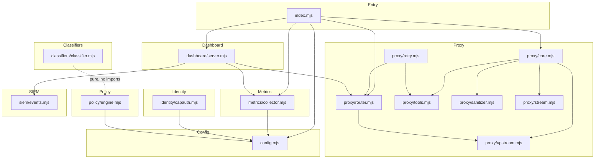

# SKGateway — Developer Guide

## Contents

1. [Module Overview](#module-overview)
2. [Dependency Diagram](#dependency-diagram)
3. [Adding a New Backend Provider](#adding-a-new-backend-provider)
4. [Adding a New SIEM Output Adapter](#adding-a-new-siem-output-adapter)
5. [Adding a New Policy Transform](#adding-a-new-policy-transform)
6. [Adding a New Prompt Classifier Category](#adding-a-new-prompt-classifier-category)
7. [Adding a New Tool Group for Semantic Routing](#adding-a-new-tool-group-for-semantic-routing)
8. [Testing Guide](#testing-guide)
9. [Code Conventions](#code-conventions)
10. [Key Design Decisions](#key-design-decisions)

---

## Module Overview

SKGateway is a single-process Node.js service. All source lives under `src/` and
is divided into seven subsystems:

| Directory | Purpose |
|-----------|---------|
| `src/proxy/` | Core HTTP proxy: routing, tool reduction, sanitization, retry, streaming |
| `src/identity/` | CapAuth PGP identity extraction and agent registry |
| `src/policy/` | YAML-driven rule engine (allow / deny / transform / rate\_limit / alert) |
| `src/classifiers/` | Regex-based prompt classification, risk scoring, jailbreak detection |
| `src/metrics/` | SQLite token/cost/latency tracking with P² percentile estimators |
| `src/siem/` | Structured SIEM event bus, CEF formatter, output adapters |
| `src/dashboard/` | SOC dashboard: plain Node.js HTTP server + raw WebSocket push |

The entrypoint is `src/index.mjs`. It wires the subsystems together but does not
own any logic itself.

### File-by-file summary

| File | Exports (key) | Responsibility |
|------|---------------|---------------|
| `proxy/core.mjs` | `createProxyServer`, `handleRequest`, `buildConfig` | Unified proxy core; four-layer retry; response fixups |
| `proxy/router.mjs` | `createRouter` | Backend registry; health tracking; fallover |
| `proxy/tools.mjs` | `reduceTools`, `stripToolCallHistory`, `DEFAULT_TOOL_GROUPS` | Tool budget management; semantic keyword routing |
| `proxy/sanitizer.mjs` | `sanitizeContent`, `sanitizeRequest`, `detectPII`, `scanDLP` | Request/response sanitization; PII flagging |
| `proxy/retry.mjs` | `classifyError`, `withRetry` | Error classification; exponential backoff; circuit breakers |
| `proxy/stream.mjs` | `SSEWriter`, `SSEParser`, `jsonToSSE`, `passthroughStream` | SSE framing; keep-alive; upstream stream relay |
| `proxy/upstream.mjs` | `sendUpstream` | Raw HTTP relay to a selected backend |
| `identity/capauth.mjs` | `loadAgentRegistry`, `identityMiddleware` | CapAuth PGP verification; agent registry |
| `policy/engine.mjs` | `createPolicyEngine`, `loadPolicies`, `evaluatePolicy` | YAML rule loading; O(rules × conditions) evaluation |
| `classifiers/classifier.mjs` | `classifyPrompt`, `scoreRisk`, `detectJailbreak`, `detectInjection` | Pure regex/keyword classification; zero ML deps |
| `metrics/collector.mjs` | `createMetricsCollector` | Token/cost/latency aggregation; SQLite batch writes |
| `siem/events.mjs` | `createEventBus`, `createEvent`, `formatCEF`, `EventType` | Event factory; in-memory pub/sub bus; CEF formatter |
| `dashboard/server.mjs` | `createDashboardServer` | REST API + WebSocket; static file serving |
| `config.mjs` | `loadConfig`, `getConfig`, `getPricing` | YAML config loader; deep-merge defaults; SIGHUP reload |

---

## Dependency Diagram



**Import rules:**
- `config.mjs` has no internal imports (only Node built-ins + `js-yaml`).
- `classifiers/classifier.mjs` is completely self-contained.
- `siem/events.mjs` only imports `node:crypto`.
- `dashboard/server.mjs` reads from `metrics` and `router` via constructor injection,
  not direct `import` coupling.
- No circular dependencies exist. The dependency graph is a strict DAG.

---

## Adding a New Backend Provider

A "backend" is an HTTP endpoint that speaks the OpenAI chat-completions wire
format. Adding one requires two steps: registering it in the router config, then
(optionally) adding a custom auth injector.

### Step 1 — Config entry

Add a block under `backends:` in `config/skgateway.yaml`:

```yaml
backends:
  my_provider:
    url: https://api.myprovider.com/v1
    auth_type: api_key          # api_key | oauth | bearer | none
    api_key_env: MY_PROVIDER_KEY
    models:
      - "my-model-7b"
      - "my-model-*"            # glob patterns are supported
    priority: 4                 # lower = preferred
    cooldown_ms: 30000          # optional: override down-state cooldown
```

The router discovers all keys under `backends:` at startup and registers them
automatically. No code changes are needed for the basic case.

### Step 2 — Custom auth type (if needed)

Open `src/proxy/router.mjs` and locate the `injectAuth()` function (search for
`function injectAuth`). The function receives `(headers, backendCfg)` and mutates
`headers` in place. Add a new `case` to the switch:

```js
case 'my_custom_auth':
  headers['X-My-Provider-Token'] = loadSecret(backendCfg.token_env);
  break;
```

The four built-in auth types are:

| `auth_type` | Behaviour |
|-------------|-----------|
| `api_key` | Reads env var named by `api_key_env`; sets `Authorization: Bearer <key>` |
| `oauth` | Reads JSON credentials from `credentials_path`; refreshes as needed |
| `bearer` | Reads env var named by `token_env`; sets `Authorization: Bearer <token>` |
| `none` | No auth header added (for Ollama / local endpoints) |

### Step 3 — Health probe endpoint (optional)

By default the router probes `GET /health` on the backend URL. If your provider
uses a different liveness path, set `health_path` in the config:

```yaml
backends:
  my_provider:
    health_path: /v1/models   # GET this path during recovery probes
```

### Step 4 — Model mapping

If your provider uses non-standard model IDs that clients send under a different
name, add a `model_aliases` map:

```yaml
backends:
  my_provider:
    model_aliases:
      "gpt-4": "my-model-7b"   # rewrite before forwarding
```

Model rewriting happens in `router.mjs` before the upstream call.

---

## Adding a New SIEM Output Adapter

The SIEM event bus (`src/siem/events.mjs`) forwards every event to all registered
output adapters. An adapter is any object with a single `write(event)` method.

### Minimal adapter interface

```js
// src/siem/outputs/myoutput.mjs
export function createMyOutput(config) {
  return {
    /**
     * Receive a GatewayEvent and forward it to the external system.
     * May be async (the bus awaits it with a timeout).
     *
     * @param {import('../events.mjs').GatewayEvent} event
     */
    async write(event) {
      // your delivery logic here
    },
  };
}
```

### Registration

In `src/index.mjs`, after the bus is created, call `bus.addOutput()`:

```js
import { createMyOutput } from './siem/outputs/myoutput.mjs';

const myOutput = createMyOutput(config.siem.my_output);
bus.addOutput(myOutput);
```

Or make it config-driven by adding a case to the output factory in
`src/siem/events.mjs`:

```js
// in createOutputsFromConfig(siemConfig) — add:
case 'my_output':
  outputs.push(createMyOutput(cfg));
  break;
```

Then users can enable it purely from YAML:

```yaml
siem:
  outputs:
    - type: my_output
      endpoint: https://collector.example.com
```

### Using CEF vs. JSONL

The bus emits raw `GatewayEvent` objects. If your target expects CEF, call
`formatCEF(event)` from `siem/events.mjs` inside your adapter's `write()` method.
For JSONL, call `JSON.stringify(event)`.

### Backpressure

The bus maintains an internal ring buffer (`maxBuffer`, default 1000 events).
If your adapter is slow, events are queued there. When the buffer fills, the
oldest events are dropped and an overflow counter is incremented. Design your
adapter to be non-blocking; do expensive I/O asynchronously.

---

## Adding a New Policy Transform

Transforms are named effects applied to a request before it is forwarded. They
do not stop the policy chain — after a transform runs, evaluation continues.

### Step 1 — Register the transform name

In `src/policy/engine.mjs` add the identifier to `KNOWN_TRANSFORMS`:

```js
export const KNOWN_TRANSFORMS = new Set([
  'redact_pii',
  'downgrade_model',
  'strip_tools',
  'add_safety_prompt',
  'my_new_transform',   // <-- add here
]);
```

### Step 2 — Implement the transform

In `src/policy/engine.mjs`, locate the `applyTransform(transform, request, ruleCfg)`
function and add a case:

```js
case 'my_new_transform':
  // mutate request.body in place
  request.body.my_field = ruleCfg.my_param ?? 'default_value';
  break;
```

The `request` object has:
- `request.body` — parsed JSON body (mutable)
- `request.headers` — incoming HTTP headers (mutable)
- `request.context` — identity/classification context (read-only here)

The `ruleCfg` object is the full rule YAML node, so any extra fields you add to
the YAML rule are available here.

### Step 3 — Add YAML support

No schema validation exists beyond `KNOWN_TRANSFORMS`. Write a rule like:

```yaml
- name: "apply-my-transform"
  condition:
    agent_id: "some-agent"
  action: transform
  transform: my_new_transform
  my_param: "value"
  severity: low
```

### Step 4 — Add a test

```js
// tests/policy.test.mjs
test('my_new_transform sets my_field', () => {
  const engine = createPolicyEngine([{
    name: 'test-rule',
    condition: { agent_id: 'test' },
    action: 'transform',
    transform: 'my_new_transform',
    my_param: 'hello',
  }]);
  const req = { body: {}, headers: {}, context: { agent_id: 'test' } };
  engine.evaluate(req, { agent_id: 'test' });
  assert.equal(req.body.my_field, 'hello');
});
```

---

## Adding a New Prompt Classifier Category

The classifier (`src/classifiers/classifier.mjs`) uses a keyword-scored category
map. Each category is defined by a set of regex patterns with associated weights.

### Step 1 — Add the category identifier

In `classifier.mjs`, update the `IntentCategory` JSDoc typedef:

```js
/**
 * @typedef {'code_generation'|'data_query'|'creative'|'administrative'|
 *           'security_sensitive'|'tool_use'|'conversation'|'system'|
 *           'my_category'} IntentCategory
 */
```

### Step 2 — Add keyword patterns

Locate `CATEGORY_PATTERNS` (the main scoring map) and add an entry. Patterns are
pre-compiled at module load:

```js
my_category: {
  weight: 2.0,   // multiplier applied to all keyword matches in this category
  patterns: [
    /\b(my|keyword|list)\b/i,
    /some other pattern/i,
  ],
},
```

Adjust `weight` relative to existing categories. The winning category is the one
with the highest aggregate score; `confidence` is `winner_score / total_score`.

### Step 3 — Add to the policy engine context

The `prompt_class` field in policy conditions is populated from the classifier
result. If you want to write rules targeting your new category, it works
automatically — the string is passed through directly.

```yaml
- name: "handle-my-category"
  condition:
    prompt_class: "my_category"
  action: alert
  severity: info
```

### Step 4 — Write tests

Follow the pattern in `tests/classifier.test.mjs`:

```js
test('detects my_category', () => {
  const msgs = [{ role: 'user', content: 'trigger phrase for my category' }];
  const result = classifyPrompt(msgs);
  assert.equal(result.category, 'my_category');
});
```

Run with:

```
node --test tests/classifier.test.mjs
```

---

## Adding a New Tool Group for Semantic Routing

Tool groups are keyword-to-tool-list mappings that boost relevant tools when the
user's message mentions certain terms. They live in `src/proxy/tools.mjs`.

### Step 1 — Add to DEFAULT_TOOL_GROUPS

```js
export const DEFAULT_TOOL_GROUPS = {
  // ... existing groups ...

  // My new domain
  "my_keyword|another_word|third_term": [
    "my_tool_one",
    "my_tool_two",
    "exec",         // exec is always safe to include — it's guaranteed anyway
  ],
};
```

Keys are pipe-delimited regex alternation patterns (case-insensitive). When ANY
keyword matches the user's most recent message, ALL tools in the array receive a
+300 semantic score boost, making them the most likely survivors of tool reduction.

### Step 2 — Override via config (preferred for deployment-specific groups)

You can specify custom tool groups in `config/skgateway.yaml` under `tools.groups`
without touching source code:

```yaml
tools:
  guaranteed:
    - exec
    - read
    - write
    - edit
    - message
  groups:
    "my_keyword|another_word":
      - my_tool_one
      - my_tool_two
```

The config loader merges user-defined groups over `DEFAULT_TOOL_GROUPS` at
startup. On `SIGHUP`, groups are reloaded without restart.

### Step 3 — Understand scoring

The full scoring pipeline for a tool is:

```
base_score = priority_list_index_bonus   (tools higher in DEFAULT_PRIORITY_TOOLS score higher)
+ semantic_boost (0 or +300 from keyword match)
+ guaranteed_bonus (guaranteed tools always survive regardless of score)
```

Tools are sorted by descending score and the top `max_budget` (default 16) are
kept. Guaranteed tools are placed first, then scored tools fill remaining slots.

---

## Testing Guide

### Running all tests

```bash
node --test tests/
```

### Running a single test file

```bash
node --test tests/classifier.test.mjs
```

### Running with verbose output

```bash
node --test --reporter=tap tests/
```

The test runner is Node.js's built-in `node:test` module (Node 20+). No external
test framework is required.

### Writing a new test file

Create `tests/<module>.test.mjs`. Follow this scaffold:

```js
/**
 * <module>.test.mjs — Tests for src/<module>.mjs
 * Run with: node --test tests/<module>.test.mjs
 */
import { test, describe } from 'node:test';
import assert from 'node:assert/strict';
import { myFunction } from '../src/<module>.mjs';

describe('myFunction', () => {
  test('returns expected value', () => {
    const result = myFunction('input');
    assert.equal(result, 'expected');
  });

  test('throws on invalid input', () => {
    assert.throws(() => myFunction(null), /expected error message/);
  });
});
```

### Testing the proxy end-to-end

The proxy can be started against a mock upstream for integration tests:

```js
import http from 'node:http';
import { createProxyServer } from '../src/proxy/core.mjs';

// Start a mock upstream
const upstream = http.createServer((req, res) => {
  res.writeHead(200, { 'content-type': 'application/json' });
  res.end(JSON.stringify({ choices: [{ message: { content: 'hello' } }] }));
});
await new Promise(r => upstream.listen(0, '127.0.0.1', r));
const upstreamPort = upstream.address().port;

// Start the gateway pointing at the mock
const proxy = createProxyServer({
  targetUrl: `http://127.0.0.1:${upstreamPort}`,
  port: 0,
});
await new Promise(r => proxy.listen(0, '127.0.0.1', r));
const proxyPort = proxy.address().port;

// Issue a request through the gateway
const res = await fetch(`http://127.0.0.1:${proxyPort}/v1/chat/completions`, {
  method: 'POST',
  headers: { 'content-type': 'application/json' },
  body: JSON.stringify({ model: 'test', messages: [{ role: 'user', content: 'hi' }] }),
});
const body = await res.json();
assert.equal(body.choices[0].message.content, 'hello');

proxy.close();
upstream.close();
```

### Performance assertions

The classifier has a hard `<5ms` budget enforced in tests:

```js
const start = performance.now();
const result = classifyPrompt(msgs);
const ms = performance.now() - start;
assert.ok(ms < 5, `classifier took ${ms.toFixed(2)}ms — must be <5ms`);
```

Add similar timing assertions for any hot-path code you add.

---

## Code Conventions

### ES modules

All files use ES module syntax (`import`/`export`). No CommonJS (`require`).
File extensions are always `.mjs`.

```js
// Good
import { foo } from './foo.mjs';
export function bar() {}

// Bad
const foo = require('./foo');
module.exports = { bar };
```

### JSDoc

All exported functions and types must have JSDoc. Use `@typedef` for complex
types rather than TypeScript. The project has no TypeScript compiler — JSDoc is
the contract.

```js
/**
 * Short one-line summary.
 *
 * Longer explanation if needed.
 *
 * @param {string}  name    - Description of param.
 * @param {number}  [count] - Optional param with default.
 * @returns {string}
 */
export function myFunction(name, count = 1) { … }
```

### No external dependencies (where possible)

The production dependency list is intentionally minimal:
- `better-sqlite3` — SQLite bindings (metrics only)
- `js-yaml` — YAML parsing (config and policies)

Do not add new npm dependencies without discussion. Node built-ins (`node:http`,
`node:crypto`, `node:stream`, etc.) are preferred. The classifier, sanitizer,
retry engine, SIEM bus, and stream handler all have zero external deps.

### Pure functions

Functions in `classifier.mjs`, `sanitizer.mjs`, `retry.mjs`, and `stream.mjs`
are pure (or close to it). They do not perform I/O, mutate global state, or
produce side effects beyond their return value. Keep them that way.

The one exception is `sanitizeRequest`, which mutates `body.messages` in-place
by convention (to avoid copying potentially large arrays). This is documented in
the function's JSDoc.

### Error handling

- Functions that can fail return structured results rather than throwing.
- Constructors/factories throw if misconfigured (fail-fast at startup).
- The proxy never crashes the process on a per-request error — it always sends
  an HTTP error response.
- All async operations in `index.mjs` are wrapped in try/catch so optional
  subsystems (metrics, dashboard) can fail without taking down the proxy.

### Logging

Use the `logger` object passed through config, not `console.log` directly:

```js
// In proxy/core.mjs and router.mjs
cfg.logger.log('[router] selected backend: nvidia');
cfg.logger.warn('[router] backend degraded: anthropic (error rate 12%)');
cfg.logger.error('[proxy] upstream returned 500');
```

The default logger writes to `console`. Replace it in config for structured
logging:

```js
const cfg = buildConfig({
  logger: {
    log:   (msg) => myLogger.info(msg),
    warn:  (msg) => myLogger.warn(msg),
    error: (msg) => myLogger.error(msg),
  },
});
```

---

## Key Design Decisions

### SQLite for metrics storage

Metrics are written to a local SQLite database (`better-sqlite3`) rather than
an external time-series store. Rationale:

- **Zero infrastructure dependency.** The gateway starts immediately with no
  external service required.
- **Batch writes with 5-second flush.** Individual requests are buffered in
  memory and written in a single transaction every 5 seconds (or every 100
  events). This keeps write amplification negligible.
- **Auto-purge.** Rows older than `retention_days` (default 90) are deleted
  every 6 hours. No manual maintenance needed.
- **Query simplicity.** The dashboard reads token usage and cost breakdowns
  with straightforward GROUP BY queries. No ORM or query builder is needed.

### P² algorithm for latency percentiles

Latency P50/P95/P99 are computed using the P² streaming estimator (Jain &
Chlamtac, 1985) rather than storing all samples. Rationale:

- **O(1) memory.** Each estimator uses exactly 5 marker values regardless of
  how many requests have been processed.
- **Good accuracy.** P² is typically within 1–2% of the true quantile for
  latency distributions.
- **No sort, no ring buffer.** Avoids the `O(n log n)` cost of exact quantile
  computation on long-running instances.

One estimator instance per quantile (P50, P95, P99) is created at startup and
runs for the lifetime of the process.

### CEF for SIEM output

ArcSight Common Event Format (CEF) is used as the default structured event
format. Rationale:

- **Broad support.** CEF is natively parsed by Splunk, IBM QRadar, ArcSight, and
  most syslog aggregators.
- **Single-line.** CEF events are newline-terminated single-line strings —
  trivially written to files, syslog, or TCP sockets without framing complexity.
- **Deterministic escaping.** The spec defines exact escaping rules for `|` in
  headers and `=` in extension values, making output predictable.

JSONL is also supported (and is what the default `file` output adapter writes)
for easy ingestion into Elastic / Loki / any JSON-aware pipeline.

### Tool reduction before first upstream call

The proxy proactively reduces the tool list to `max_budget` (default 16) on the
first attempt rather than waiting for the upstream to reject the request.
Rationale:

- **NVIDIA NIM rejects requests with large tool counts** with a `400 "single
  tool-calls"` error. Proactive reduction avoids this round-trip entirely.
- **Smaller payloads.** A large tools array can add tens of kilobytes to every
  request. Reducing it once saves bandwidth on every call in a long session.
- **Semantic routing.** Proactive reduction gives the opportunity to keep the
  most-relevant tools for the current query, improving model behaviour.

### Four-layer retry with progressive degradation

The retry engine (`retry.mjs`) implements four escalating layers rather than a
simple "retry N times":

```
Layer 1: same backend, same model, reduced tools
Layer 2: same backend, alternate (failover) model
Layer 3: next backend by priority
Layer 4: text-only (strip all tools) — last resort
```

This matches real-world failure modes: NVIDIA `400` errors are almost always
tool-payload issues (Layer 1 fixes them), while `503` errors require a backend
switch (Layer 3).

### No Express / no web framework

The HTTP server (`proxy/core.mjs`, `dashboard/server.mjs`) uses Node's built-in
`http` module directly. Rationale:

- **Minimal attack surface.** No framework vulnerabilities.
- **Zero startup overhead.** No framework initialisation.
- **Explicit routing.** The proxy only serves two paths (`/v1/chat/completions`
  and health checks). A full framework would be wasteful.
- **WebSocket without ws package.** The dashboard WebSocket is implemented using
  raw RFC 6455 framing, again to avoid a dependency.
