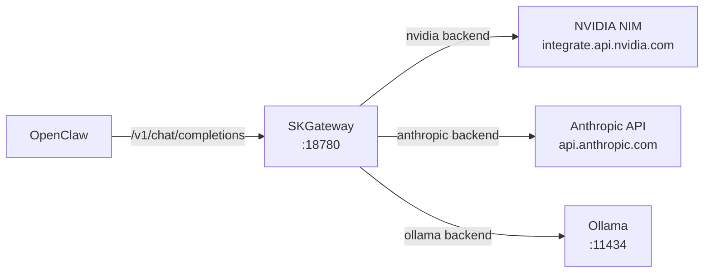

# SKGateway — OpenClaw Integration Guide

This guide explains how to route all OpenClaw AI inference through SKGateway. Once configured, every model call OpenClaw makes will pass through the proxy, giving you real-time monitoring, token cost tracking, audit logs, and security classification — all visible in the SOC dashboard.

---

## What This Does

OpenClaw talks to NVIDIA NIM (and other providers) over HTTP. SKGateway runs locally on port 18780 and acts as a transparent pass-through: OpenClaw thinks it is talking directly to NVIDIA, but every request is inspected, logged, and tracked first.



The proxy adds less than 5ms of overhead on the local loopback. Streaming (SSE) works transparently — you will not notice any difference in OpenClaw's behavior.

---

## Step 1: Configure SKGateway Backend for NVIDIA NIM

Make sure your `config/skgateway.yaml` has a `nvidia` backend pointing at the real NVIDIA endpoint:

```yaml
backends:
  nvidia:
    url: https://integrate.api.nvidia.com/v1
    auth_type: api_key
    api_key_env: NVIDIA_API_KEY
    models:
      - kimi-k2-instruct
      - kimi-k2.5
      - minimax-m2.1
    priority: 1
```

Start SKGateway and confirm it is running:

```bash
curl -s http://localhost:18780/health | jq .backends.nvidia.status
# "up"
```

---

## Step 2: Update openclaw.json — Point the NVIDIA Provider at SKGateway

Open `~/.openclaw/openclaw.json` and find the `models.providers.nvidia` section. Change the `baseUrl` from the live NVIDIA endpoint to your local SKGateway:

**Before:**
```json
"nvidia": {
  "baseUrl": "https://integrate.api.nvidia.com/v1",
  "apiKey": "nvapi-..."
}
```

**After:**
```json
"nvidia": {
  "baseUrl": "http://127.0.0.1:18780/v1",
  "apiKey": "nvapi-..."
}
```

The `apiKey` field stays the same — SKGateway reads `NVIDIA_API_KEY` from the environment and forwards it to NVIDIA automatically. The key in `openclaw.json` is still needed so OpenClaw knows the provider requires auth.

Save the file. OpenClaw picks up config changes without a restart.

---

## Step 3: Add an Anthropic Backend (Optional)

To also route Anthropic (Claude) calls through SKGateway, add an `anthropic` backend to `skgateway.yaml`:

```yaml
backends:
  anthropic:
    url: https://api.anthropic.com/v1
    auth_type: oauth
    credentials_path: ~/.claude/.credentials.json
    models:
      - claude-opus-4-6
      - claude-sonnet-4-6
    priority: 2
```

Then in `openclaw.json`, find your Anthropic provider entry and update its `baseUrl` the same way:

```json
"anthropic": {
  "baseUrl": "http://127.0.0.1:18780/v1",
  "apiKey": "sk-ant-..."
}
```

SKGateway uses the `models` list in each backend config to route requests to the correct upstream. A request for `claude-opus-4-6` goes to the Anthropic backend; a request for `moonshotai/kimi-k2-instruct` goes to the NVIDIA backend.

---

## Step 4: Verify in the Dashboard

Open `http://localhost:18781` in your browser. Send a message in OpenClaw and watch:

- The **Backend Health** row should show request counts climbing on the `nvidia` card
- The **Token Usage** chart should update within a few seconds
- The **Agent Activity Feed** should show a new entry for your agent

You can also query the metrics API directly:

```bash
# Recent requests
curl -s "http://localhost:18781/api/stats" | jq '{totalRequests, recentRequests5m}'

# Token usage by agent (last hour)
curl -s "http://localhost:18781/api/tokens?period=1h" | jq .rows
```

---

## Step 5: Add Agent Identity Headers

SKGateway tracks activity per agent using the `X-Agent-Id` request header. OpenClaw can be configured to send this header automatically by setting the `SKCAPSTONE_AGENT` environment variable before launching it:

```bash
SKCAPSTONE_AGENT=lumina openclaw
```

Or add it to the OpenClaw environment in `~/.openclaw/openclaw.json`:

```json
"env": {
  "SKCAPSTONE_AGENT": "lumina"
}
```

When `SKCAPSTONE_AGENT` is set, SKGateway records all requests under that agent name. This is what makes the per-agent columns in the token chart and cost tracker work.

---

## FAQ

**Does routing through SKGateway add latency?**

Minimal — typically less than 5ms on the loopback interface. The proxy does no ML inference; it runs regex classification and SQLite writes on a separate async path. For streaming responses, the first token arrives at the same time as if you were talking to NVIDIA directly.

**Does it break streaming (SSE)?**

No. SKGateway passes SSE frames through unchanged. The dashboard gets its data from a separate metrics path, not by buffering the stream. If you request `stream: true`, the response arrives as a standard SSE stream just as before.

**Can I still use OpenClaw without SKGateway?**

Yes. To stop routing through the proxy, revert `baseUrl` in `openclaw.json` back to the original NVIDIA endpoint:

```json
"baseUrl": "https://integrate.api.nvidia.com/v1"
```

No other changes are needed. All your OpenClaw sessions, models, and tools continue to work exactly as before.

**What happens if SKGateway goes down?**

OpenClaw will get connection errors until SKGateway is restarted. To avoid this during development or upgrades, temporarily revert the `baseUrl` while you work on the gateway, then switch it back.

**Can I run SKGateway on a different machine?**

Yes. Change `127.0.0.1` to the machine's IP address in the `baseUrl`. Make sure the gateway port (18780) is reachable from the OpenClaw host — either over LAN or Tailscale.

**Will my NVIDIA API key be sent over the network twice?**

No. OpenClaw sends the key to SKGateway over the local loopback (never leaves the machine). SKGateway then includes it in the forwarded request to NVIDIA. The key in `openclaw.json` is only used locally by OpenClaw to construct the Authorization header.
