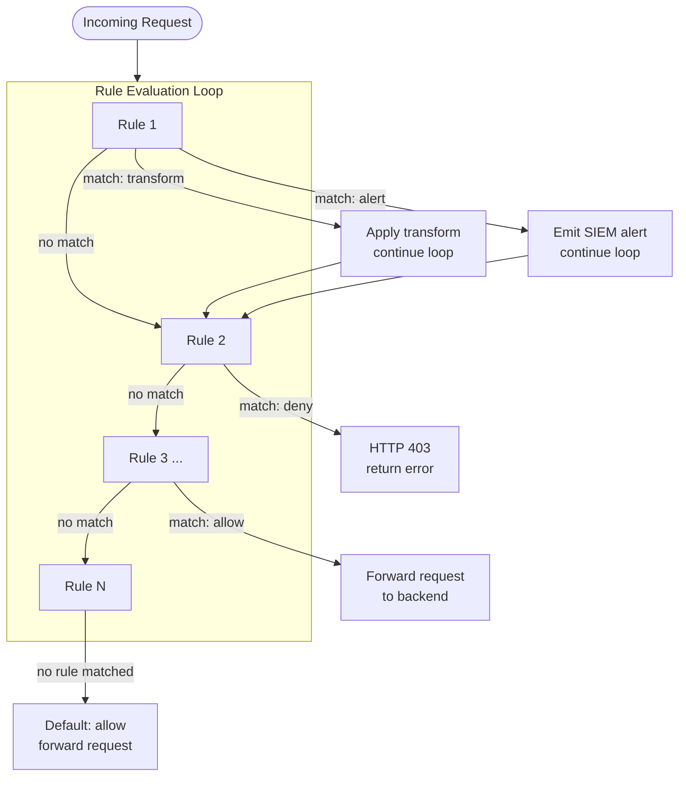

# SKGateway — Policy Writing Guide

## Contents

1. [Overview](#overview)
2. [Policy Evaluation Order](#policy-evaluation-order)
3. [Rule Schema](#rule-schema)
4. [Condition Fields](#condition-fields)
5. [Actions](#actions)
6. [Transforms](#transforms)
7. [Rate Limit Configuration](#rate-limit-configuration)
8. [Example Rules](#example-rules)
9. [Full Policy File Template](#full-policy-file-template)

---

## Overview

Policies are defined in `config/policies.yaml` as an ordered list of rules.
Each rule matches a set of conditions against the request context and takes an
action. Rules are evaluated in order from top to bottom.

SKGateway supports two categories of rules:

- **Terminating rules** (`allow`, `deny`, `rate_limit`): Stop evaluation when matched.
- **Non-terminating rules** (`transform`, `alert`): Apply their effect and continue to the next rule.

This means a single request can trigger multiple non-terminating rules before
reaching a terminating one.

Reload at runtime: `kill -HUP $(pgrep -f skgateway)`

---

## Policy Evaluation Order



**Key principle:** The first `allow`, `deny`, or `rate_limit` rule that matches
ends evaluation. `transform` and `alert` rules that match apply their effect and
fall through to the next rule.

If no rule matches, the request is allowed by default.

---

## Rule Schema

```yaml
rules:
  - name: "unique-rule-name"         # string, required, must be unique
    condition:                        # map of field → operator/value (AND logic)
      field_name: value_or_operator
    action: allow                     # allow | deny | transform | rate_limit | alert
    transform: redact_pii             # required when action=transform
    fallback_model: "kimi-k2-instruct" # used by downgrade_model transform
    safety_prompt: |                  # used by add_safety_prompt transform
      Your safety instruction here.
    message: "Human-readable reason"  # returned to caller on deny/rate_limit
    severity: info                    # info | low | medium | high | critical
```

All fields except `name`, `condition`, and `action` are optional.

---

## Condition Fields

All conditions in a rule must match for the rule to fire (logical AND).
A rule with an empty `condition:` block matches every request.

### String fields (exact match or glob)

```yaml
condition:
  agent_id: "lumina"          # exact match
  model: "claude-opus-*"      # glob pattern — * matches any chars
  backend: "anthropic"        # exact match: nvidia | anthropic | ollama | <custom>
  prompt_class: "tool_use"    # classified intent (see classifier categories below)
```

| Field | Type | Description |
|-------|------|-------------|
| `agent_id` | string / glob | Agent identifier from identity middleware. E.g. `"lumina"`, `"sentinel"`, `"bot-*"`. |
| `model` | string / glob | Model ID from the request. Glob patterns supported. E.g. `"claude-opus-*"`, `"kimi-k2-instruct"`. |
| `backend` | string | Backend name as defined in `backends:` config. |
| `prompt_class` | string | Prompt intent category from the classifier. One of: `code_generation`, `data_query`, `creative`, `administrative`, `security_sensitive`, `tool_use`, `conversation`, `system`. |

Glob matching: `*` matches any sequence of characters. `?` matches any single
character. Matching is case-insensitive.

### Numeric fields (operator prefix)

```yaml
condition:
  risk_score: ">= 7"          # operator: >= > <= < ==
  jailbreak_score: ">= 9"
  tokens_today: ">= 500000"
  budget_remaining: "< 1.00"
```

| Field | Type | Range | Description |
|-------|------|-------|-------------|
| `risk_score` | float | 0–10 | Aggregate risk score from the classifier. 0 = low risk, 10 = critical. |
| `jailbreak_score` | float | 0–10 | Confidence score from jailbreak pattern detection. 0 = clean, 10 = confirmed jailbreak attempt. |
| `tokens_today` | integer | 0–∞ | Total tokens consumed by this agent today (resets at UTC midnight). |
| `budget_remaining` | float | 0–∞ | USD budget remaining for this agent (from metrics + pricing config). |

Operators: `>=`, `>`, `<=`, `<`, `==`. The value is a quoted string in YAML
(e.g. `">= 8"` not `>= 8`).

### Boolean fields

```yaml
condition:
  pii_detected: true
  agent_budget_exceeded: true
```

| Field | Type | Description |
|-------|------|-------------|
| `pii_detected` | boolean | `true` if `detectPII()` found any PII patterns in the request messages. |
| `agent_budget_exceeded` | boolean | `true` if the agent's configured cost budget has been consumed. |

### Time-of-day range

```yaml
condition:
  time_of_day: "22:00-06:00"    # HH:MM-HH:MM, 24-hour, wraps midnight
```

| Field | Type | Description |
|-------|------|-------------|
| `time_of_day` | string | Active time window in `HH:MM-HH:MM` format (UTC). Ranges that cross midnight are supported (e.g. `"22:00-06:00"`). |

---

## Actions

### `allow`

Immediately allow the request. Skips all remaining rules.

```yaml
- name: "allow-lumina"
  condition:
    agent_id: "lumina"
  action: allow
  severity: info
```

Use `allow` to create an explicit allowlist that short-circuits later
deny/transform rules.

### `deny`

Reject the request with HTTP 403. The `message` field is returned in the response
body as `{"error": {"message": "...","type": "policy_violation"}}`.

```yaml
- name: "block-jailbreak"
  condition:
    jailbreak_score: ">= 9"
  action: deny
  message: "Request blocked: jailbreak attempt detected"
  severity: critical
```

### `transform`

Modify the request in place and continue evaluation. Does not stop the rule
chain. See [Transforms](#transforms) for available transform types.

```yaml
- name: "redact-pii"
  condition:
    pii_detected: true
  action: transform
  transform: redact_pii
  severity: medium
```

### `rate_limit`

Reject the request with HTTP 429 when the agent or model has exceeded their
configured rate limit. The `message` field is returned in the response body.

Rate limits are configured in the `rate_limits:` section of the policy file
(separate from individual rules). This action can also be triggered by a rule:

```yaml
- name: "rate-limit-bots"
  condition:
    agent_id: "bot-*"
  action: rate_limit
  message: "Bot agent rate limit exceeded — try again in 60 seconds"
  severity: low
```

### `alert`

Emit a `policy_violation` SIEM event with the rule name, severity, and details.
Does not modify or block the request. Continues rule evaluation.

```yaml
- name: "alert-elevated-risk"
  condition:
    risk_score: ">= 6"
  action: alert
  severity: high
```

Alert events appear in the SIEM output and the dashboard event feed.

---

## Transforms

### `redact_pii`

Replaces detected PII in all message content with labeled placeholders.

```yaml
- name: "redact-pii"
  condition:
    pii_detected: true
  action: transform
  transform: redact_pii
```

Detected patterns and their replacements:

| Pattern | Replacement |
|---------|-------------|
| Email address | `[EMAIL REDACTED]` |
| US phone number | `[PHONE REDACTED]` |
| US Social Security Number (SSN) | `[SSN REDACTED]` |
| Credit card number (Luhn-validated) | `[CREDIT CARD REDACTED]` |
| IP address (v4) | `[IP REDACTED]` |
| AWS access key (`AKIA...`) | `[AWS KEY REDACTED]` |
| Private key PEM block | `[PRIVATE KEY REDACTED]` |

Luhn validation is applied to credit card candidates to reduce false positives.
PII detection is purely additive (flag only); `redact_pii` is what actually
modifies the request.

### `downgrade_model`

Replaces the requested model with a fallback model before forwarding.

```yaml
- name: "downgrade-on-budget-exceeded"
  condition:
    agent_budget_exceeded: true
  action: transform
  transform: downgrade_model
  fallback_model: "kimi-k2-instruct"
  severity: medium
```

The `fallback_model` field is required. It must be a model ID served by one of
the configured backends.

### `strip_tools`

Removes the `tools` and `tool_choice` fields from the request body before
forwarding. Forces the model to respond in text-only mode.

```yaml
- name: "strip-sentinel-tools"
  condition:
    agent_id: "sentinel"
  action: transform
  transform: strip_tools
  severity: info
```

### `add_safety_prompt`

Prepends a safety instruction to the system message (or creates a system message
if none is present).

```yaml
- name: "safety-prompt-elevated-risk"
  condition:
    risk_score: ">= 6"
  action: transform
  transform: add_safety_prompt
  safety_prompt: >
    You are operating in a monitored session. Respond helpfully, accurately,
    and safely. Do not assist with harmful, illegal, or deceptive content.
    If unsure, err on the side of caution.
  severity: medium
```

The `safety_prompt` field contains the text to prepend. YAML block scalars
(`>` for folded, `|` for literal) are both supported.

---

## Rate Limit Configuration

The `rate_limits:` section (at the top level of `policies.yaml`, not inside
`rules:`) defines limits applied to every request. These are enforced in
addition to any `rate_limit` action rules.

```yaml
rate_limits:
  default:                      # applied to any agent/model not matched below
    requests_per_min: 60
    requests_per_hour: 1000
    requests_per_day: 10000
    tokens_per_min: 200000
    tokens_per_hour: 2000000
    tokens_per_day: 20000000
    burst: 10                   # requests allowed above the per-minute limit
                                # in a short burst (token bucket size)

  agents:                       # per-agent overrides (glob patterns supported)
    lumina:
      requests_per_min: 120
      requests_per_hour: 2000
      requests_per_day: 20000
      tokens_per_min: 500000
      tokens_per_hour: 5000000
      tokens_per_day: 50000000
      burst: 20

    sentinel:                   # read-only monitoring agent — strict limits
      requests_per_min: 10
      requests_per_hour: 100
      requests_per_day: 500
      tokens_per_min: 10000
      tokens_per_hour: 50000
      tokens_per_day: 200000
      burst: 3

  models:                       # per-model overrides (glob patterns supported)
    "claude-opus-*":
      requests_per_min: 20
      requests_per_hour: 200
      requests_per_day: 1000
      tokens_per_min: 50000
      tokens_per_hour: 500000
      tokens_per_day: 5000000
      burst: 5

    "kimi-k2-instruct":
      requests_per_min: 120
      requests_per_hour: 3000
      requests_per_day: 50000
      tokens_per_min: 500000
      tokens_per_hour: 10000000
      tokens_per_day: 100000000
      burst: 20
```

**Resolution order:** Agent limits take precedence over model limits; both take
precedence over `default`.

**Counters:** All counters are stored in memory and reset on process restart.
Token counts for `tokens_today` conditions in rules are read from the SQLite
metrics database and persist across restarts.

---

## Example Rules

### 1. Block critical jailbreak attempts

```yaml
- name: "block-jailbreak-critical"
  condition:
    jailbreak_score: ">= 9"
  action: deny
  message: "Request blocked: high-confidence jailbreak attempt detected"
  severity: critical
```

### 2. Alert on moderate jailbreak confidence

```yaml
- name: "alert-jailbreak-moderate"
  condition:
    jailbreak_score: ">= 7"
  action: alert
  severity: high
```

### 3. Redact PII from outbound requests

```yaml
- name: "redact-pii-outbound"
  condition:
    pii_detected: true
  action: transform
  transform: redact_pii
  severity: medium
```

### 4. Add safety context to risky prompts

```yaml
- name: "safety-prompt-elevated-risk"
  condition:
    risk_score: ">= 6"
  action: transform
  transform: add_safety_prompt
  safety_prompt: >
    You are operating in a monitored environment. Respond helpfully and safely.
    Do not assist with harmful, illegal, or deceptive content.
  severity: medium
```

### 5. Restrict a read-only monitoring agent

```yaml
# Deny expensive models for the sentinel (read-only monitoring) agent
- name: "restrict-sentinel-model"
  condition:
    agent_id: "sentinel"
    model: "claude-opus-*"
  action: deny
  message: "Sentinel agent may not use Opus — use kimi-k2-instruct"
  severity: medium

# Remove tool access from sentinel entirely
- name: "strip-sentinel-tools"
  condition:
    agent_id: "sentinel"
  action: transform
  transform: strip_tools
  severity: info
```

### 6. Budget fallback — downgrade when cost budget exceeded

```yaml
- name: "budget-fallback-downgrade"
  condition:
    agent_budget_exceeded: true
  action: transform
  transform: downgrade_model
  fallback_model: "kimi-k2-instruct"
  severity: medium

- name: "alert-budget-low"
  condition:
    budget_remaining: "< 1.00"
  action: alert
  message: "Agent budget critically low (< $1.00 remaining)"
  severity: high
```

### 7. After-hours model downgrade

```yaml
- name: "after-hours-downgrade"
  condition:
    time_of_day: "22:00-06:00"
    model: "claude-opus-*"
  action: transform
  transform: downgrade_model
  fallback_model: "kimi-k2-instruct"
  severity: info
```

### 8. Token quota enforcement

```yaml
# Alert at 80% of daily quota
- name: "token-quota-warning"
  condition:
    tokens_today: ">= 400000"
  action: alert
  message: "Agent approaching daily token quota (400k+ consumed)"
  severity: medium

# Downgrade model at 100% quota
- name: "token-quota-downgrade"
  condition:
    tokens_today: ">= 500000"
  action: transform
  transform: downgrade_model
  fallback_model: "kimi-k2-instruct"
  severity: high
```

### 9. Restrict a terminal agent to local/free models

```yaml
- name: "jarvis-no-anthropic"
  condition:
    agent_id: "jarvis"
    backend: "anthropic"
  action: deny
  message: "Jarvis is restricted to local and NVIDIA models"
  severity: low
```

### 10. Security-sensitive prompts get safety prompt

```yaml
- name: "security-class-safety"
  condition:
    prompt_class: "security_sensitive"
  action: transform
  transform: add_safety_prompt
  safety_prompt: |
    Security-relevant request detected. Provide accurate, responsible information.
    Do not provide working exploit code, credentials, or instructions that could
    cause direct harm without appropriate safeguards.
  severity: medium
```

### 11. Explicit allowlist for trusted primary agents

```yaml
- name: "allow-lumina"
  condition:
    agent_id: "lumina"
  action: allow
  severity: info

- name: "allow-swarm-artisan"
  condition:
    agent_id: "artisan"
  action: allow
  severity: info
```

### 12. Rate-limit anonymous requests

```yaml
- name: "rate-limit-anonymous"
  condition:
    agent_id: "anonymous"
  action: rate_limit
  message: "Anonymous requests are rate-limited — provide an agent identity"
  severity: low
```

---

## Full Policy File Template

```yaml
## SKGateway Policy Configuration
## Rules are evaluated in order. First terminating match wins.

rules:

  ## ── Security ────────────────────────────────────────────────────────────────

  - name: "block-jailbreak-critical"
    condition:
      jailbreak_score: ">= 9"
    action: deny
    message: "Request blocked: jailbreak attempt detected"
    severity: critical

  - name: "alert-jailbreak-moderate"
    condition:
      jailbreak_score: ">= 7"
    action: alert
    severity: high

  - name: "block-high-risk"
    condition:
      risk_score: ">= 9"
    action: deny
    message: "Request blocked: risk score exceeds threshold"
    severity: critical

  - name: "safety-prompt-elevated-risk"
    condition:
      risk_score: ">= 6"
    action: transform
    transform: add_safety_prompt
    safety_prompt: >
      You are in a monitored session. Respond helpfully, accurately, and safely.
    severity: medium

  ## ── PII Protection ──────────────────────────────────────────────────────────

  - name: "redact-pii"
    condition:
      pii_detected: true
    action: transform
    transform: redact_pii
    severity: medium

  ## ── Agent Restrictions ──────────────────────────────────────────────────────

  - name: "strip-sentinel-tools"
    condition:
      agent_id: "sentinel"
    action: transform
    transform: strip_tools
    severity: info

  - name: "restrict-sentinel-model"
    condition:
      agent_id: "sentinel"
      model: "claude-*"
    action: deny
    message: "Sentinel may not use Anthropic models"
    severity: medium

  ## ── Budget Controls ─────────────────────────────────────────────────────────

  - name: "budget-downgrade"
    condition:
      agent_budget_exceeded: true
    action: transform
    transform: downgrade_model
    fallback_model: "kimi-k2-instruct"
    severity: medium

  - name: "alert-low-budget"
    condition:
      budget_remaining: "< 1.00"
    action: alert
    severity: high

  ## ── Token Quota ─────────────────────────────────────────────────────────────

  - name: "token-quota-downgrade"
    condition:
      tokens_today: ">= 500000"
    action: transform
    transform: downgrade_model
    fallback_model: "kimi-k2-instruct"
    severity: high

  ## ── Allowlist ───────────────────────────────────────────────────────────────

  - name: "allow-lumina"
    condition:
      agent_id: "lumina"
    action: allow
    severity: info

  - name: "allow-swarm"
    condition:
      agent_id: "artisan"
    action: allow
    severity: info

## ── Rate Limits ───────────────────────────────────────────────────────────────

rate_limits:
  default:
    requests_per_min: 60
    requests_per_hour: 1000
    requests_per_day: 10000
    tokens_per_min: 200000
    tokens_per_hour: 2000000
    tokens_per_day: 20000000
    burst: 10

  agents:
    lumina:
      requests_per_min: 120
      tokens_per_day: 50000000
      burst: 20
    sentinel:
      requests_per_min: 10
      tokens_per_day: 200000
      burst: 3
```
