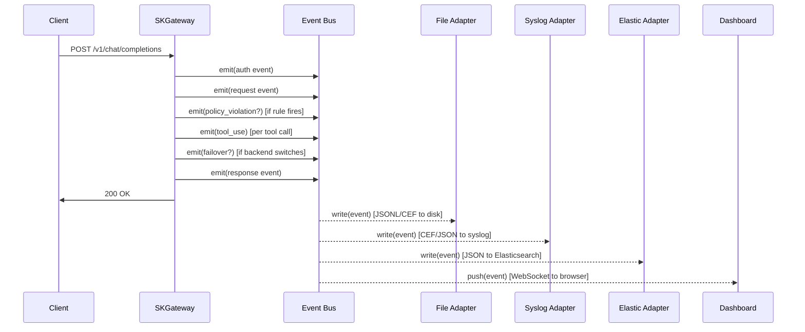

# SKGateway — SIEM Integration Guide

## Contents

1. [Overview](#overview)
2. [Event Flow](#event-flow)
3. [Event Types](#event-types)
   - [auth](#auth)
   - [request](#request)
   - [response](#response)
   - [error](#error)
   - [policy\_violation](#policy_violation)
   - [anomaly](#anomaly)
   - [failover](#failover)
   - [tool\_use](#tool_use)
4. [Output Formats](#output-formats)
   - [JSONL Format](#jsonl-format)
   - [CEF Format](#cef-format)
5. [Output Adapters](#output-adapters)
   - [File (JSONL / CEF)](#file-adapter)
   - [Syslog](#syslog-adapter)
   - [Elasticsearch](#elasticsearch-adapter)
6. [Integration Examples](#integration-examples)
   - [Forwarding to Splunk](#forwarding-to-splunk)
   - [Forwarding to Elastic / Kibana](#forwarding-to-elastic--kibana)
   - [Forwarding to rsyslog](#forwarding-to-rsyslog)
7. [Writing a Custom Output Adapter](#writing-a-custom-output-adapter)

---

## Overview

SKGateway emits structured audit events for every significant action in the
request lifecycle. Events flow through an in-memory pub/sub bus to one or more
output adapters. The bus buffers up to 1000 events when adapters fall behind.

All events share the same top-level envelope structure. Type-specific data is
nested in the `details` object.

The two supported wire formats are:

- **JSONL** — one JSON object per line; suited for Elastic, Loki, and any
  JSON-aware pipeline.
- **CEF** — ArcSight Common Event Format; suited for Splunk, IBM QRadar, and
  enterprise SIEM appliances.

---

## Event Flow



The bus is synchronous for the `emit()` call (the event is placed in the ring
buffer immediately), but adapter writes happen asynchronously on a background
flush timer. The request response is not delayed by SIEM output.

---

## Event Types

All events share this envelope:

```json
{
  "event_id":   "550e8400-e29b-41d4-a716-446655440000",
  "timestamp":  "2026-03-17T14:32:11.042Z",
  "event_type": "<type>",
  "severity":   "info",
  "source":     "skgateway",
  "agent_id":   "lumina",
  "session_id": "sess-abc123",
  "request_id": "req-def456",
  "backend":    "nvidia",
  "model":      "kimi-k2-instruct",
  "details":    { ... }
}
```

Top-level envelope fields:

| Field | Type | Always present | Description |
|-------|------|----------------|-------------|
| `event_id` | UUID string | Yes | Unique identifier for this event. |
| `timestamp` | ISO 8601 string | Yes | UTC creation time. |
| `event_type` | string | Yes | One of the 8 event types below. |
| `severity` | string | Yes | `info`, `warning`, `error`, or `critical`. |
| `source` | string | Yes | Always `"skgateway"`. |
| `agent_id` | string | No | Agent identifier (e.g. `"lumina"`). Present when identity is resolved. |
| `session_id` | string | No | Session/conversation UUID from `X-Session-Id` header. |
| `request_id` | string | No | Per-request UUID. |
| `backend` | string | No | Selected backend name. |
| `model` | string | No | Model name targeted. |
| `details` | object | Yes | Type-specific payload (see each type below). |

---

### `auth`

Emitted when agent identity is resolved (or fails to resolve).

**Default severity:** `info` (success) / `warning` (failure)

```json
{
  "event_type": "auth",
  "severity": "info",
  "agent_id": "lumina",
  "details": {
    "success": true,
    "method": "header",
    "reason": null
  }
}
```

```json
{
  "event_type": "auth",
  "severity": "warning",
  "agent_id": "anonymous",
  "details": {
    "success": false,
    "method": "capauth",
    "reason": "signature verification failed: clock skew > 300s"
  }
}
```

**`details` fields:**

| Field | Type | Description |
|-------|------|-------------|
| `success` | boolean | Whether identity was successfully resolved and verified. |
| `method` | string | How identity was determined: `header` (X-Agent-Id), `capauth` (PGP signature), `bearer` (token), `session` (session correlation only), `anonymous`. |
| `reason` | string / null | Failure reason when `success: false`. |

---

### `request`

Emitted when a new inference request is received and classified.

**Default severity:** `info`

```json
{
  "event_type": "request",
  "severity": "info",
  "agent_id": "lumina",
  "backend": "nvidia",
  "model": "kimi-k2-instruct",
  "details": {
    "prompt_class": "tool_use",
    "token_estimate": 2400,
    "tool_count": 16
  }
}
```

**`details` fields:**

| Field | Type | Description |
|-------|------|-------------|
| `prompt_class` | string | Top intent category from the classifier. |
| `token_estimate` | integer | Estimated input token count (character-based heuristic). |
| `tool_count` | integer | Number of tools in the request after reduction. |

---

### `response`

Emitted when the upstream response is successfully returned to the client.

**Default severity:** `info`

```json
{
  "event_type": "response",
  "severity": "info",
  "agent_id": "lumina",
  "backend": "nvidia",
  "model": "kimi-k2-instruct",
  "details": {
    "status": 200,
    "tokens_in": 2400,
    "tokens_out": 312,
    "cost": 0.0,
    "latency_ms": 892
  }
}
```

**`details` fields:**

| Field | Type | Description |
|-------|------|-------------|
| `status` | integer | HTTP status code from the upstream backend. |
| `tokens_in` | integer | Input tokens reported by the backend. |
| `tokens_out` | integer | Output tokens reported by the backend. |
| `cost` | float | USD cost calculated from token counts × model pricing. |
| `latency_ms` | integer | Total request duration in milliseconds (gateway receives request → client receives last byte). |

---

### `error`

Emitted when a request fails (non-2xx from backend, network error, or internal
error) and is not recovered by the retry engine.

**Default severity:** `error`

```json
{
  "event_type": "error",
  "severity": "error",
  "agent_id": "lumina",
  "backend": "anthropic",
  "model": "claude-opus-4-6",
  "details": {
    "type": "backend_error",
    "status_code": 529,
    "backend": "anthropic",
    "retry_count": 3,
    "message": "Anthropic API overloaded"
  }
}
```

**`details` fields:**

| Field | Type | Description |
|-------|------|-------------|
| `type` | string | Error class: `rate_limit`, `bad_payload`, `auth_error`, `backend_error`, `overloaded`, `timeout`, `network`, `unknown`. |
| `status_code` | integer | HTTP status code (502 used for network errors). |
| `backend` | string | Backend where the error occurred. |
| `retry_count` | integer | Number of retry attempts made before giving up. |
| `message` | string | Human-readable error description. |

---

### `policy_violation`

Emitted when a policy rule with action `deny`, `alert`, or `transform` (severity
≥ medium) fires.

**Default severity:** `warning`

```json
{
  "event_type": "policy_violation",
  "severity": "critical",
  "agent_id": "unknown",
  "model": "claude-opus-4-6",
  "details": {
    "rule": "block-jailbreak-critical",
    "severity": "critical",
    "details": "jailbreak_score=9.2 >= 9 threshold",
    "action": "deny"
  }
}
```

**`details` fields:**

| Field | Type | Description |
|-------|------|-------------|
| `rule` | string | Name of the matching policy rule. |
| `severity` | string | Severity declared in the rule. |
| `details` | string | Human-readable description of which condition matched. |
| `action` | string | The action taken: `deny`, `transform`, `alert`, `rate_limit`. |

---

### `anomaly`

Emitted when the classifier or runtime heuristics detect unusual behaviour
that does not fit a specific rule.

**Default severity:** `warning`

```json
{
  "event_type": "anomaly",
  "severity": "warning",
  "agent_id": "lumina",
  "details": {
    "type": "token_spike",
    "score": 8.5,
    "baseline": 2000,
    "observed": 95000
  }
}
```

**`details` fields:**

| Field | Type | Description |
|-------|------|-------------|
| `type` | string | Anomaly category: `token_spike`, `rapid_requests`, `tool_call_loop`, `prompt_injection`, `unusual_model_switch`. |
| `score` | float | Anomaly confidence score 0–10. |
| `baseline` | number / string | Expected value or range. |
| `observed` | number / string | Observed value that triggered the anomaly. |

---

### `failover`

Emitted when the retry engine switches from one backend to another.

**Default severity:** `warning`

```json
{
  "event_type": "failover",
  "severity": "warning",
  "agent_id": "lumina",
  "details": {
    "from_backend": "anthropic",
    "to_backend": "nvidia",
    "reason": "backend_error: HTTP 529 (overloaded)"
  }
}
```

**`details` fields:**

| Field | Type | Description |
|-------|------|-------------|
| `from_backend` | string | Backend that failed. |
| `to_backend` | string | Backend that took over. |
| `reason` | string | Error class and status code that triggered the failover. |

---

### `tool_use`

Emitted once per tool invocation when tools are present in the response.

**Default severity:** `info`

```json
{
  "event_type": "tool_use",
  "severity": "info",
  "agent_id": "lumina",
  "model": "kimi-k2-instruct",
  "details": {
    "tool_name": "skmemory_search",
    "success": true,
    "duration_ms": 47
  }
}
```

**`details` fields:**

| Field | Type | Description |
|-------|------|-------------|
| `tool_name` | string | Name of the tool that was called. |
| `success` | boolean | Whether the tool call completed without a gateway-level error. |
| `duration_ms` | integer | Time from tool call detected in response to tool result received from client (round-trip from the gateway's perspective). |

---

## Output Formats

### JSONL Format

One JSON object per line. Human-readable, easy to `grep`, and natively parsed by
Elastic, Loki, Vector, Fluentd, and most modern log pipelines.

```
{"event_id":"550e8400...","timestamp":"2026-03-17T14:32:11.042Z","event_type":"request","severity":"info","source":"skgateway","agent_id":"lumina","backend":"nvidia","model":"kimi-k2-instruct","details":{"prompt_class":"tool_use","token_estimate":2400,"tool_count":16}}
{"event_id":"661f9511...","timestamp":"2026-03-17T14:32:12.134Z","event_type":"response","severity":"info","source":"skgateway","agent_id":"lumina","backend":"nvidia","model":"kimi-k2-instruct","details":{"status":200,"tokens_in":2400,"tokens_out":312,"cost":0,"latency_ms":892}}
```

### CEF Format

ArcSight Common Event Format. Single-line, pipe-delimited header followed by
space-delimited `key=value` extension pairs.

```
CEF:0|SKWorld|SKGateway|0.1.0|request|Incoming Inference Request|3|rt=1742219531042 src=skgateway suid=lumina cs1=sess-abc123 cs1Label=sessionId cs2=req-def456 cs2Label=requestId dst=nvidia dproc=kimi-k2-instruct msg={"prompt_class":"tool_use","token_estimate":2400,"tool_count":16} cs3=550e8400-e29b-41d4-a716-446655440000 cs3Label=eventId
```

**CEF header format:**
```
CEF:0|<Vendor>|<Product>|<Version>|<SignatureID>|<Name>|<Severity>|<Extension>
```

| Header field | Value |
|-------------|-------|
| Vendor | `SKWorld` |
| Product | `SKGateway` |
| Version | `0.1.0` |
| SignatureID | The `event_type` value (e.g. `request`, `policy_violation`) |
| Name | Human-readable event name (e.g. `Incoming Inference Request`) |
| Severity | Integer 0–10: `info`→3, `warning`→6, `error`→8, `critical`→10 |

**CEF extension field mapping:**

| CEF key | Label | Source |
|---------|-------|--------|
| `rt` | — | `timestamp` (epoch milliseconds) |
| `src` | — | `source` (always `skgateway`) |
| `suid` | — | `agent_id` |
| `cs1` | `sessionId` | `session_id` |
| `cs2` | `requestId` | `request_id` |
| `dst` | — | `backend` |
| `dproc` | — | `model` |
| `msg` | — | `details` serialized as JSON |
| `cs3` | `eventId` | `event_id` |

---

## Output Adapters

### File Adapter

Writes events to a local file. Supports both JSONL and CEF formats with
automatic rotation.

```yaml
siem:
  enabled: true
  outputs:
    - type: file
      path: ./logs/audit.jsonl
      rotate_mb: 100
      format: jsonl          # jsonl | cef
```

The file is created (with parent directories) if it does not exist. When the
file exceeds `rotate_mb` megabytes, it is renamed to `<path>.1` and a new file
is started. Only one rotated generation is kept.

### Syslog Adapter

Forwards events to a syslog server using UDP or TCP transport.

```yaml
siem:
  outputs:
    - type: syslog
      host: syslog.internal
      port: 514
      protocol: udp     # udp | tcp
      format: cef       # cef | json
      facility: 16      # 16 = local0
```

Each event is sent as a single RFC 5424 syslog message. Priority is calculated
from the CEF severity integer. The syslog timestamp uses the event's
`timestamp` field.

### Elasticsearch Adapter

Indexes events into Elasticsearch (or OpenSearch) using the bulk API.

```yaml
siem:
  outputs:
    - type: elasticsearch
      url: http://elasticsearch:9200
      index: skgateway-events
      username: elastic
      password_env: ES_PASSWORD
      batch_size: 50
      flush_interval_ms: 5000
```

Events are batched and flushed every `flush_interval_ms` or when `batch_size`
is reached, whichever comes first. The `_id` field is set to `event_id` to
ensure idempotent indexing on retry.

---

## Integration Examples

### Forwarding to Splunk

**Option A: Splunk Universal Forwarder reading the JSONL file**

1. Configure SKGateway to write JSONL:

   ```yaml
   siem:
     outputs:
       - type: file
         path: /var/log/skgateway/audit.jsonl
         format: jsonl
         rotate_mb: 100
   ```

2. Add a Splunk monitor stanza in `inputs.conf`:

   ```ini
   [monitor:///var/log/skgateway/audit.jsonl]
   index = skgateway
   sourcetype = _json
   ```

3. In Splunk, create a field extraction for the nested `details` object or use
   `spath` in searches:

   ```
   index=skgateway sourcetype=_json
   | spath input=_raw
   | search event_type="policy_violation"
   | table timestamp agent_id details.rule details.action
   ```

**Option B: Splunk HEC (HTTP Event Collector) via syslog adapter**

1. Configure syslog to forward to Splunk HEC over TCP on port 8088:

   ```yaml
   siem:
     outputs:
       - type: syslog
         host: splunk.internal
         port: 8088
         protocol: tcp
         format: cef
   ```

2. In Splunk, configure an HEC token that accepts CEF data and set the
   `sourcetype` to `arcsight`. Splunk natively parses CEF extension fields.

---

### Forwarding to Elastic / Kibana

**Option A: Direct Elasticsearch output (recommended)**

```yaml
siem:
  outputs:
    - type: elasticsearch
      url: http://elasticsearch:9200
      index: skgateway-events
      username: elastic
      password_env: ES_PASSWORD
```

Create an index template in Kibana (Dev Tools):

```json
PUT _index_template/skgateway
{
  "index_patterns": ["skgateway-*"],
  "template": {
    "settings": { "number_of_shards": 1 },
    "mappings": {
      "properties": {
        "timestamp":  { "type": "date" },
        "event_type": { "type": "keyword" },
        "severity":   { "type": "keyword" },
        "agent_id":   { "type": "keyword" },
        "backend":    { "type": "keyword" },
        "model":      { "type": "keyword" },
        "session_id": { "type": "keyword" },
        "request_id": { "type": "keyword" }
      }
    }
  }
}
```

In Kibana, create a data view for `skgateway-*` with `timestamp` as the time
field. Useful Kibana Lens visualisations:
- Events over time by `event_type` (bar chart)
- Policy violations by `details.rule` (pie chart)
- Token usage by `agent_id` using `details.tokens_in` sum
- Latency P95 using `details.latency_ms` percentile aggregation

**Option B: Logstash pipeline from JSONL file**

```
input {
  file {
    path => "/var/log/skgateway/audit.jsonl"
    codec => "json"
    sincedb_path => "/var/lib/logstash/skgateway.sincedb"
  }
}

filter {
  date { match => ["timestamp", "ISO8601"] target => "@timestamp" }
  mutate { rename => { "event_type" => "skgw_event_type" } }
}

output {
  elasticsearch {
    hosts => ["http://elasticsearch:9200"]
    index => "skgateway-%{+YYYY.MM.dd}"
    user => "elastic"
    password => "${ES_PASSWORD}"
  }
}
```

---

### Forwarding to rsyslog

**Receive CEF events from SKGateway syslog adapter:**

Configure SKGateway:

```yaml
siem:
  outputs:
    - type: syslog
      host: 127.0.0.1
      port: 514
      protocol: udp
      format: cef
      facility: 16
```

Add to `/etc/rsyslog.conf`:

```
# Receive UDP syslog on port 514
module(load="imudp")
input(type="imudp" port="514")

# Route local0 facility (SKGateway) to its own file
local0.*    /var/log/skgateway/cef.log

# Forward to remote SIEM over TCP
local0.*    @@siem.internal:601
```

Restart rsyslog:

```bash
systemctl restart rsyslog
```

For RELP (Reliable Event Logging Protocol) forwarding, use:

```
module(load="omrelp")
local0.*    action(type="omrelp" target="siem.internal" port="2514")
```

---

## Writing a Custom Output Adapter

A custom adapter is any object that implements the `write(event)` method.

```js
// src/siem/outputs/webhook.mjs

/**
 * Webhook output adapter — POST events to an HTTP endpoint.
 *
 * @param {{ url: string, auth_header?: string, batch_size?: number }} config
 * @returns {{ write(event: GatewayEvent): Promise<void> }}
 */
export function createWebhookOutput(config) {
  const { url, auth_header, batch_size = 20 } = config;
  let batch = [];
  let flushTimer = null;

  function scheduleFlush() {
    if (flushTimer) return;
    flushTimer = setTimeout(flush, 2000);
  }

  async function flush() {
    flushTimer = null;
    if (batch.length === 0) return;
    const events = batch.splice(0);
    try {
      await fetch(url, {
        method: 'POST',
        headers: {
          'content-type': 'application/json',
          ...(auth_header ? { authorization: auth_header } : {}),
        },
        body: JSON.stringify({ events }),
      });
    } catch (err) {
      // swallow — don't crash the gateway on SIEM output failure
      console.error('[webhook-siem] delivery failed:', err.message);
    }
  }

  return {
    async write(event) {
      batch.push(event);
      if (batch.length >= batch_size) {
        await flush();
      } else {
        scheduleFlush();
      }
    },
  };
}
```

Register it in `src/index.mjs` or inside the SIEM output factory:

```js
import { createWebhookOutput } from './siem/outputs/webhook.mjs';

const webhookOutput = createWebhookOutput({
  url: 'https://hooks.example.com/skgateway',
  auth_header: `Bearer ${process.env.WEBHOOK_TOKEN}`,
  batch_size: 20,
});

bus.addOutput(webhookOutput);
```
